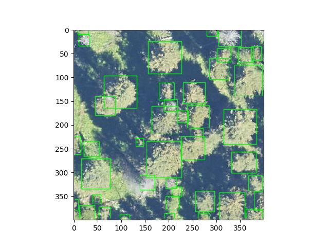

# DeepForest

[](https://github.com/weecology/DeepForest/actions/workflows/Conda-app.yml)
[](http://deepforest.readthedocs.io/en/latest/?badge=latest)
[](https://pypi.python.org/pypi/DeepForest)
[](https://doi.org/10.5281/zenodo.2538143)


### Conda-forge build status

| Name | Downloads | Version | Platforms |
| --- | --- | --- | --- |
| [](https://anaconda.org/conda-forge/deepforest) | [](https://anaconda.org/conda-forge/deepforest) | [](https://anaconda.org/conda-forge/deepforest) | [](https://anaconda.org/conda-forge/deepforest) |



A pytorch implementation of the DeepForest model for individual tree crown detection in RGB images. DeepForest is a python package for training and predicting individual tree crowns from airborne RGB imagery. DeepForest comes with a prebuilt model trained on data from the National Ecological Observatory Network. Users can extend this model by annotating and training custom models starting from the prebuilt model.

<sub> DeepForest es un paquete de python para la predicción de coronas de árboles individuales basada en modelos entrenados con imágenes remotas RVA ( RGB, por sus siglas en inglés). DeepForest viene con un modelo entrenado con datos proveídos por la Red Nacional de Observatorios Ecológicos (NEON, por sus siglas en inglés). Los usuarios pueden ampliar este modelo pre-construido por anotación de etiquetas y entrenamiento con datos locales. La documentación de DeepForest está escrita en inglés, sin embargo, agradeceríamos contribuciones con fin de hacerla accesible en otros idiomas.  <sub>

 <sub> DeepForest(PyTorch版本)是一个Python软件包，它可以被用来训练以及预测机载RGB图像中的单个树冠。DeepForest内部带有一个基于国家生态观测站网络(NEON : National Ecological Observatory Network)数据训练的预训练模型。在此模型基础上，用户可以注释新的数据然后训练自己的模型。DeepForest的文档是用英文编写的，如果您有兴趣为翻译文档做出贡献。欢迎与我们团队联系。<sub>

## Motivation

 The goal of deepforest is to provide an easy to access deep learning model for tree crown prediction in RGB images. The baseline model was primarily designed for *forest* images in 3cm imagery. Applications to urban images and lower resolution data can be successful, but need additional effort. For basic use see
  
 https://deepforest.readthedocs.io/en/latest/getting_started.html#

#### Try Demo using Jupyter Notebook

Incorportating local data will always help prediction accuracy to customize the release model see see [Google colab demo on model training](https://colab.research.google.com/drive/1gKUiocwfCvcvVfiKzAaf6voiUVL2KK_r?usp=sharing)

# Installation

Deepforest can be install using either pip or conda.

## pip

```
pip install deepforest
```

## conda CPU

Conda-based installs can be slow. We recommend using [mamba](https://mamba.readthedocs.io/en/latest/user_guide/mamba.html) to speed them up.

```
conda create -n deepforest python=3 pytorch torchvision -c pytorch
conda activate deepforest
conda install deepforest albumentations -c conda-forge
```

## conda GPU

Depending on the GPU you will need with `cudatoolkit=10.2` or `cudatoolkit=11.3`:

```
conda create -n deepforest python=3 pytorch torchvision cudatoolkit=10.2 -c pytorch
conda activate deepforest
conda install deepforest albumentations -c conda-forge
```

# Usage

# Use Benchmark release

```Python
from deepforest import main
m = main.deepforest()
m.use_release()
```

## Train a new model

```Python
m.create_trainer()
m.trainer.fit(m)
m.evaluate(csv_file=m.config["validation"]["csv_file"], root_dir=m.config["validation"]["root_dir"])
```
 
## Predict a single image

```Python
from deepforest import main
csv_file = '/Users/benweinstein/Documents/DeepForest/deepforest/data/OSBS_029.tif'
df = trained_model.predict_file(csv_file, root_dir = os.path.dirname(csv_file))
```

## Predict a large tile

```Python
predicted_boxes = trained_model.predict_tile(raster_path = raster_path,
                                        patch_size = 300,
                                        patch_overlap = 0.5,
                                        return_plot = False)
```

## Evaluate a file of annotations using intersection-over-union

```Python
csv_file = get_data("example.csv")
root_dir = os.path.dirname(csv_file)
results = m.evaluate(csv_file, root_dir, iou_threshold = 0.5)
```

# Config

DeepForest comes with a default config file (deepforest_config.yml) to control the location of training and evaluation data, the number of gpus, batch size and other hyperparameters. This file can be edited directly, or using the config dictionary after loading a deepforest object.

```Python
from deepforest import main
m = main.deepforest()
m.config["batch_size"] = 10
```
Config parameters are documented [here](https://deepforest.readthedocs.io/en/latest/ConfigurationFile.html).

# Tree Detection Benchmark score

Tree detection is a central task in forest ecology and remote sensing. The Weecology Lab at the University of Florida has built a tree detection benchmark for evaluation. After building a model, you can compare it to the benchmark using the evaluate method.

```
git clone https://github.com/weecology/NeonTreeEvaluation.git
cd NeonTreeEvaluation
```
```Python
results = m.evaluate(csv_file = "evaluation/RGB/benchmark_annotations.csv", root_dir = "evaluation/RGB/")
results["box_recall"]
results["box_precision"]
```

# Using DeepForest in R

R wrapper is available for DeepForest in the [deepforestr package](https://github.com/weecology/deepforestr).
