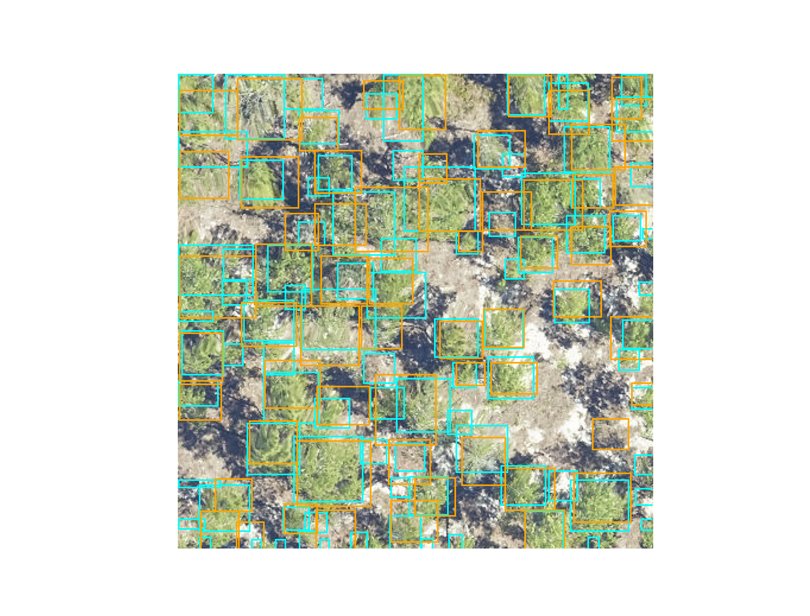

# Evaluation 

To convert overlap among predicted and ground truth bounding boxes into measures of accuracy and precision, the most common approach is to compare the overlap using the intersection-over-union metric (IoU).
IoU is the ratio between the area of the overlap between the predicted polygon box and the ground truth polygon box divided by and the area of the combined bounding box region.

Let's start by getting some sample data and predictions

```
from deepforest import evaluate
from deepforest import main
from deepforest import get_data
from deepforest import visualize
import os
import pandas as pd

m = main.deepforest()
m.use_release()

csv_file = get_data("OSBS_029.csv")
predictions = m.predict_file(csv_file=csv_file, root_dir=os.path.dirname(csv_file))
predictions.head()
    xmin   ymin   xmax   ymax label     score    image_path
0  330.0  342.0  373.0  391.0  Tree  0.802979  OSBS_029.tif
1  216.0  206.0  248.0  242.0  Tree  0.778803  OSBS_029.tif
2  325.0   44.0  363.0   82.0  Tree  0.751573  OSBS_029.tif
3  261.0  238.0  296.0  276.0  Tree  0.748605  OSBS_029.tif
4  173.0    0.0  229.0   33.0  Tree  0.738209  OSBS_029.tif
```

```
ground_truth = pd.read_csv(csv_file)
ground_truth.head()
     image_path  xmin  ymin  xmax  ymax label
0  OSBS_029.tif   203    67   227    90  Tree
1  OSBS_029.tif   256    99   288   140  Tree
2  OSBS_029.tif   166   253   225   304  Tree
3  OSBS_029.tif   365     2   400    27  Tree
4  OSBS_029.tif   312    13   349    47  Tree
```

```
visualize.plot_prediction_dataframe(predictions, ground_truth, root_dir = os.path.dirname(csv_file))
```



The IoU metric ranges between 0 (no overlap) to 1 (perfect overlap). In the wider computer vision literature, the conventional threshold value for overlap is 0.5, but this value is arbitrary and does not ultimately relate to any particular ecological question. 
We considered boxes which have an IoU score of greater than 0.4 as true positive, and scores less than 0.4 as false negatives. The 0.4 value was chosen based on visual evaluation of the threshold that indicated a good visual match between the predicted and observed crown.
We tested a range of overlap thresholds from 0.3 (less overlap among matching crowns) to 0.6 (more overlap among matching crowns) and found that 0.4 balanced a rigorous cutoff without spuriously removing trees that would be useful for downstream analysis.


After computing the IoU for the ground truth data, we get the resulting dataframe.

```
result = evaluate.evaluate_image(predictions=predictions, ground_df=ground_truth, root_dir=os.path.dirname(csv_file), savedir=None)     
result.head()
    prediction_id  truth_id       IoU predicted_label true_label
90             90         0  0.059406            Tree       Tree
65             65         1  0.335366            Tree       Tree
17             17         2  0.578551            Tree       Tree
50             50         3  0.532902            Tree       Tree
34             34         4  0.595862            Tree       Tree
```

Where prediction_id is a unique ID to each predicted tree box. truth is a unique ID to each ground truth box. The predicted and true labels are tree in this, case but could generalize to multi-class problems.
From here we can calculate precision and recall at a given IoU metric. 

```
result["match"] = result.IoU > 0.4
true_positive = sum(result["match"])
recall = true_positive / result.shape[0]
precision = true_positive / predictions.shape[0]
recall
0.819672131147541
precision
0.5494505494505495
```

This can be stated as 81.97% of the ground truth boxes are correctly matched to a predicted box at IoU threshold of 0.4, and 54.94% of predicted boxes match a ground truth box. 
Optimally we want a model that is both precise and accurate.

The above logic is wrapped into the evaluate.evaluate() function

```
result = evaluate.evaluate(predictions=predictions, ground_df=ground_truth,root_dir=os.path.dirname(csv_file), savedir=None)     
```
This is a dictionary with keys

```
result.keys()
dict_keys(['results', 'box_precision', 'box_recall', 'class_recall'])
```

The added class_recall dataframe is mostly relevant for multi-class problems, in which the recall and precision per class is given.

```
result["class_recall"]
  label  recall  precision  size
0  Tree     1.0    0.67033    61
```

One important decision was how to average precision and recall across multiple images. Two reasonable options might be to take all predictions and all ground truth and compute the statistic on the entire dataset. 
This strategy makes more sense for evaluation data that are relatively homogenous across images. We prefer to take the average of per-image precision and recall. This helps balanace the dataset if some images have many trees, and other have few trees, such as when you are comparing multiple habitat types. 
Users are welcome to calculate their own statistics directly from the results dataframe.

```
result["results"].head()
    prediction_id  truth_id       IoU  ... true_label    image_path  match
90             90         0  0.059406  ...       Tree  OSBS_029.tif  False
65             65         1  0.335366  ...       Tree  OSBS_029.tif  False
17             17         2  0.578551  ...       Tree  OSBS_029.tif   True
50             50         3  0.532902  ...       Tree  OSBS_029.tif   True
34             34         4  0.595862  ...       Tree  OSBS_029.tif   True
```

## Evaluating tiles

The evaluation method uses deepforest.predict_image for each of the paths supplied in the image_path column. This means that the entire image is passed for prediction. This will not work for large images. The deepforest.predict_tile method does a couple things under hood that need to be repeated for evaluation.

psuedo_code:

```
output_annotations = deepforest.preprocess.split_raster(
    path_to_raster = <path>,
    annotations_file = <original_annotation_path>,
    base_dir = <location to save crops>
    patch_size = <size of each crop>
    
)

output_annotations.to_csv("new_annotations.csv")

results = model.evaluate(
    csv_file="new_annotations.csv",
    root_dir=<base_dir from above>
)


```

