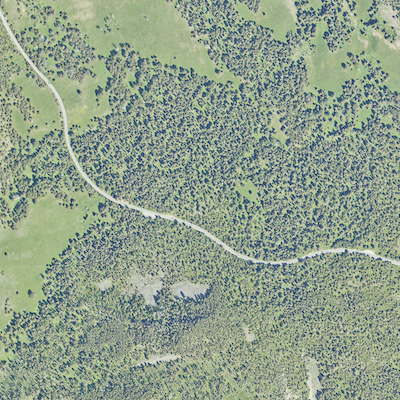
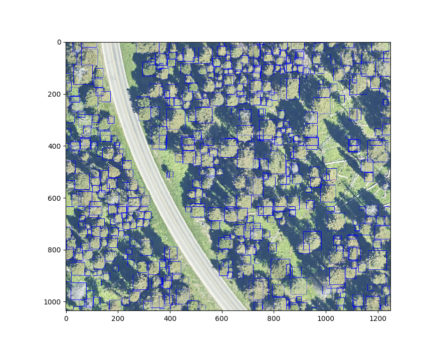

# Evaluating the prebuilt model

This document is a walkthrough of testing the DeepForest prebuilt model for a new set of annotations.

## Goal

For this example, we would like to test the accuracy of the prebuilt model for a section of Yellowstone National Park. Data for this example can be downloaded from the NEON portal under site code [YELL](https://www.neonscience.org/field-sites/field-sites-map/YELL), along with hundreds of other tiles from the same site.

### Sample Tile



## Evaluation Data

Object detection models generally require that all target objects be labeled in an image. This means that we should cut the evaluation/training tiles into sections suitable for hand annotation. For this example, these crops will be small.

After about 25 minutes of annotations, the evaluation data is complete.


The data are currently stored in an xml format. These need to be converted to the standard keras-retinanet format with one bounding box on each line. For annotations made in RectLabel, DeepForest has a parse function ```preprocess.xml_to_annotations```. For all other annotations type, the final output must match the following csv format, including column names.

```
image_path, xmin, ymin, xmax, ymax, label
```

```{python}
from matplotlib import pyplot as plt
from deepforest import deepforest
from deepforest import utilities
from deepforest import get_data
from deepforest import preprocess

#convert hand annotations from xml into retinanet format
YELL_xml = get_data("2019_YELL_2_541000_4977000_image_crop.xml")
annotation = utilities.xml_to_annotations(YELL_xml)
annotation.head()

#Write converted dataframe to file. Saved alongside the images
annotation.to_csv("deepforest/data/eval_example.csv", index=False)
```

### Evaluation windows

Often the evaluation tile is too large to be predicted as single image, due to both the memory constraints and the size of the image objects. The prebuilt model was created using square crops of 400px. Therefore we need to use the ```preprocess.split_raster``` function to perform the following operations.

1) Split the evaluation tile into windows of 400px with an overlap of 5% among windows.

2) Save the windows as new images with unique filenames.

3) Gather the correct annotations that match each window.


```{python}
#Find data on path
YELL_test = get_data("2019_YELL_2_541000_4977000_image_crop.tiff")
crop_dir = "tests/data/"
cropped_annotations= preprocess.split_raster(path_to_raster=YELL_test,
                                 annotations_file="deepforest/data/eval_example.csv",
                                 base_dir=crop_dir,
                                 patch_size=400,
                                 patch_overlap=0.05)
#View output
cropped_annotations.head()

#Write window annotations file without a header row, same location as the "base_dir" above.
eval_annotations_file= crop_dir + "cropped_example.csv"
cropped_annotations.to_csv(eval_annotations_file,index=False, header=None)
```

### Evaluate the prebuilt model

Before training a new model, it is helpful to know the performance of the current benchmark model.

Evaluate prebuilt model

```{python}
test_model = deepforest.deepforest()
test_model.use_release()

mAP = test_model.evaluate_generator(annotations=eval_annotations_file)
print("Mean Average Precision is: {:.3f}".format(mAP))
```

returns

```{python}
Reading config file: deepforest_config.yml
No model initialized, either train or load an existing retinanet model
Downloading model from DeepForest release v0.2.1, see https://github.com/weecology/DeepForest/releases/tag/v0.2.1 for details

finetuned_weights_20191126_170710.h5: 0.00B [00:00, ?B/s]
finetuned_weights_20191126_170710.h5:   0%|          | 8.19k/146M [00:00<4:08:38, 9.79kB/s]
...
finetuned_weights_20191126_170710.h5: 100%|#########9| 146M/146M [00:34<00:00, 3.65MB/s]
finetuned_weights_20191126_170710.h5: 146MB [00:34, 4.19MB/s]                           
Model was downloaded and saved to /Users/ben/Documents/DeepForest/deepforest/data/NEON.h5
Loading pre-built model: https://github.com/weecology/DeepForest/releases/tag/v0.2.1

Running network:   8% (1 of 12) |        | Elapsed Time: 0:00:02 ETA:   0:00:29
...
Running network: 100% (12 of 12) |#######| Elapsed Time: 0:00:25 Time:  0:00:25
431 instances of class Tree with average precision: 0.5400
mAP using the weighted average of precisions among classes: 0.5400
mAP: 0.5400
```

These are pretty strong results, likely because the images are similar to those used to train the prebuilt model. In our experience, scores over 0.5 are unlikely to improve without significant additional training data, targeting a specific situation in which the model is performing poorly.
[Learn more about the mAP metric.](https://towardsdatascience.com/breaking-down-mean-average-precision-map-ae462f623a52)

### Get a sample prediction

To view a prediction from the model, use ```predict_image```.

```{python}
image = test_model.predict_image("tests/data/2019_YELL_2_541000_4977000_image_crop_11.jpg", return_plot=True)

#Matplotlib views in RGB order, but model returns BGR order
plt.imshow(image[...,::-1])
```


### Predict a large extent

To predict a large extent, we can crop overlapping windows, predict trees for each window, and reassemble the final tile after applying non-max suppression to the trees that overlap in multiple windows. Non-max suppression finds overlapping boxes and keeps the box with the higher confidence score. The threshold of overlap can be set using the ```iou_threshold``` argument.

```{python}
image = test_model.predict_tile(YELL_test, return_plot=True, iou_threshold=0.75)

#Matplotlib views in RGB order, but model returns BGR order
plt.imshow(image[...,::-1])
```

