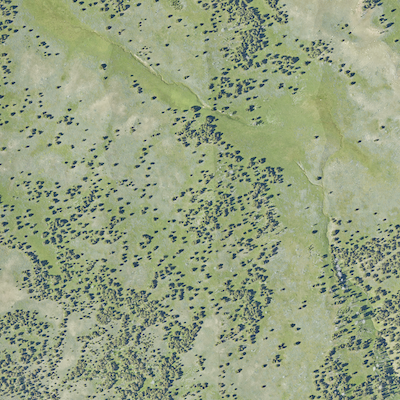

# Illustrated Example

The goal of this document is to provide a walkthrough of using DeepForest to build and test RGB deep learning tree detection models.

## Goal

For this example, we would like to build a RGB tree detection model for a section of Yellowstone National Park. Data for this example can be downloaded from the NEON portal under site code [YELL](), along with hundreds of other tiles from the same site.

### Sample Data

#### Training tile



#### Evaluation tile


## Evaluation Data

For this minimal example, we take two 1km tiles. One will be used to train the model, one will be used to test the model. It is important that training and test data be geographically separate, as the model could easily memorize features from the training data. Before training, it is critical to have a set of evaluation data to understand model performance. Using the program RectLabel, let's create a small evaluation dataset.

### Crop the evaluation tile

Object detection models generally require that all target objects be labeled in an image. This means that we should cut the evaluation/training tiles into sections suitable for hand annotation. For this example, these crops will be small.

After about 25 minutes of annotations, the evaluation tile is complete.


The data are currently stored in an xml format. These need to be converted to the standard keras-retinanet format with one bounding box on each line. For annotations made in RectLabel, DeepForest has a parse function ```preprocess.xml_to_annotations```. For all other annotations type, the final output must match the following csv format, including column names.

```
image_path, xmin, ymin, xmax, ymax, label
```

```{python}
from matplotlib import pyplot as plt
from deepforest import deepforest
from deepforest import utilities
from deepforest import get_data
from deepforest import preprocess

#convert hand annotations from xml into retinanet format
YELL_xml = get_data("2019_YELL_2_541000_4977000_image_crop.xml")
annotation = utilities.xml_to_annotations(YELL_xml)
annotation.head()

#Write converted dataframe to file. Saved alongside the images
annotation.to_csv("deepforest/data/example.csv", index=False)
```

### Evaluation windows

Often the evaluation tile is too large to be predicted as single image, due to both the memory constraints and the size of the image objects. The prebuilt model was created using square crops of 400px. Therefore we need to use the ```preprocess.split_raster``` function to perform the following operations.

1) Split the evaluation tile into windows of 400px with an overlap of 5% among windows.

2) Save the windows as new images with unique filenames.

3) Gather the correct annotations that match each window.


```{python}
#Find data on path
YELL_test = get_data("2019_YELL_2_541000_4977000_image_crop.tiff")
crop_dir = "tests/data/"
cropped_annotations= preprocess.split_raster(path_to_raster=YELL_test,
                                 annotations_file="deepforest/data/example.csv",
                                 base_dir=crop_dir,
                                 patch_size=400,
                                 patch_overlap=0.05)
#View output
cropped_annotations.head()

#Write window annotations file without a header row, same location as the "base_dir" above.
annotations_file= crop_dir + "cropped_example.csv"
cropped_annotations.to_csv(annotations_file,index=False, header=None)
```

### Evaluate against prebuilt model

Before training a new model, it is helpful to know the performance of the current benchmark model.

Evaluate prebuilt model

```{python}
test_model = deepforest.deepforest()
test_model.use_release()

mAP = test_model.evaluate_generator(annotations=annotations_file)
print("Mean Average Precision is: {:.3f}".format(mAP))
```

This returns

```{python}
Reading config file: deepforest_config.yml
No model initialized, either train or load an existing retinanet model
Downloading model from DeepForest release v0.2.1, see https://github.com/weecology/DeepForest/releases/tag/v0.2.1 for details

finetuned_weights_20191126_170710.h5: 0.00B [00:00, ?B/s]
finetuned_weights_20191126_170710.h5:   0%|          | 8.19k/146M [00:00<4:08:38, 9.79kB/s]
...
finetuned_weights_20191126_170710.h5: 100%|#########9| 146M/146M [00:34<00:00, 3.65MB/s]
finetuned_weights_20191126_170710.h5: 146MB [00:34, 4.19MB/s]                           
Model was downloaded and saved to /Users/ben/Documents/DeepForest/deepforest/data/NEON.h5
Loading pre-built model: https://github.com/weecology/DeepForest/releases/tag/v0.2.1

Running network:   8% (1 of 12) |        | Elapsed Time: 0:00:02 ETA:   0:00:29
...
Running network: 100% (12 of 12) |#######| Elapsed Time: 0:00:25 Time:  0:00:25
135 instances of class Tree with average precision: 0.4147
mAP using the weighted average of precisions among classes: 0.4147
mAP: 0.4147
Mean Average Precision is: 0.415
```

[Learn more about the mAP metric.](https://towardsdatascience.com/breaking-down-mean-average-precision-map-ae462f623a52)

### Get a sample prediction

To view a prediction from the model, use ```predict_image```.

```{python}
image = test_model.predict_image("tests/data/2019_YELL_2_541000_4977000_image_crop_11.jpg", return_plot=True)

#Matplotlib views in RGB order, but model returns BGR order
plt.imshow(image[...,::-1])
```


These are pretty decent results, likely because the images are similar to those used to train the benchmark dataset. However, let's see if added local annotated data helps. We'll start from the prebuilt model weights.

## Custom model

### Annotate training datasets

As with the evaluation data, collect training labels from a crop of the training tile and split into smaller windows.


```{python}
#convert hand annotations from xml into retinanet format
YELL_xml = get_data("2019_YELL_2_528000_4978000_image_crop2.xml")
annotation = utilities.xml_to_annotations(YELL_xml)
annotation.head()

#Write converted dataframe to file. Saved alongside the images
annotation.to_csv("deepforest/data/train_example.csv", index=False)

#Find data on path
YELL_train = get_data("2019_YELL_2_528000_4978000_image_crop2.tiff")
crop_dir = "tests/data/"
train_annotations= preprocess.split_raster(path_to_raster=YELL_test,
                                 annotations_file="deepforest/data/train_example.csv",
                                 base_dir=crop_dir,
                                 patch_size=400,
                                 patch_overlap=0.05)
#View output
train_annotations.head()

#Write window annotations file without a header row, same location as the "base_dir" above.
annotations_file= crop_dir + "train_example.csv"
cropped_annotations.to_csv(annotations_file,index=False, header=None)
```

### Config file

Training parameters are saved in a "deepforest_config.yml" file. By default DeepForest will look for this file in the current working directory.

```
###
# Config file for DeepForest module
# The following arguments
###

### Training
### Batch size. If multi-gpu is > 1, this is the total number of images per batch across all GPUs. Must be evenly divisible by multi-gpu.
batch_size: 1
### Model weights to load before training. From keras.model.save_weights()
weights: None
### Retinanet backbone. See the keras-retinanet repo for options. Only resnet50 has been well explored.
backbone: resnet50
### Resize images to min size. Retinanet anchors may need to be remade if signficantly reducing image size.
image-min-side: 800
##Number of GPUs to train
multi-gpu: 1
#Number of full cycles of the input data to train
epochs: 1
#Validation annotations. If training using fit_generator, these will be evaluated as a callback at the end of each epoch.
validation_annotations: None
###Freeze layers. Used for model finetuning, freeze the bottom n layers.
freeze_layers: 0
###Freeze resnet backbone entirely.
freeze_resnet: False

###Evaluation
###Score threshold, above which bounding boxes are included in evaluation predictions
score_threshold: 0.05

#Keras fit_generator methods, these do not apply to tfrecords input_type
multiprocessing: False
workers: 1
max_queue_size: 10
random_transform: False

#save snapshot and images
###Whether to save snapshots at the end of each epoch
save-snapshot: False
#Save directory for images and snapshots
save_path: snapshots/
snapshot_path: snapshots/
```

Using these settings, train a new model starting from the release model.

```{python}
from deepforest import deepforest

#Load the latest release
test_model = deepforest.deepforest()
test_model.use_release()

# Example run with short training
test_model.config["epochs"] = 1
test_model.config["save-snapshot"] = False
test_model.config["steps"] = 1

comet_experiment.log_parameters(deepforest_model.config)

test_model.train(annotations=annotations_file, input_type="fit_generator")
```

#### Comet visualization

For more visualization of model training, comet_ml is an extremely useful platform for understanding machine learning results. There is a free tier for academic audiences. This is optional, but worth considering if you are going to do significant testing.

```{python}
from comet_ml import Experiment
comet_experiment = Experiment(api_key=<api_key>,
                                  project_name=<project>, workspace=<"username">)
test_model.train(annotations=annotations_file, input_type="fit_generator",comet_experiment=comet_experiment)

```

Comet compute_windows


## Evaluate

```{python}

```

## Predict

Explain self.model, self.prediction_model

```{python}

```
