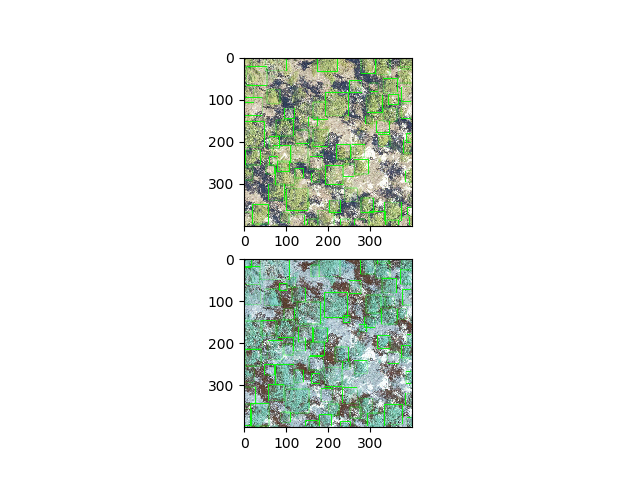

# FAQ

Commonly encountered issues
1. Conda version errors

Occasionally users report that conda enforces incorrect versions on install from source.

 ```
 ERROR: keras-retinanet 0.5.1 has requirement keras-resnet==0.1.0, but you'll have keras-resnet 0.2.0 which is incompatible.
 ```
We have yet to find an example where this prevents DeepForest from operating successfully. From our perspective, this error can be ignored. If not, please open an [issue](https://github.com/weecology/DeepForest/issues) documenting your conda version and operating system.

2. Tensorflow deprectation warnings

```
>>> from deepforest import deepforest
/anaconda3/envs/DeepForest/lib/python3.6/site-packages/tensorflow/python/framework/dtypes.py:516: FutureWarning: Passing (type, 1) or '1type' as a synonym of type is deprecated; in a future version of numpy, it will be understood as (type, (1,)) / '(1,)type'.
```

These warnings are upstream of DeepForest and can be ignored.

2. Alpha channel

```
OSError: cannot write mode RGBA as JPEG
```

If you are manually cropping an image, be careful not to save the alpha channel. For example, on OSX, the preview tool will save a 4 channel image (RGBA) instead of a three channel image (RGB) by default. When saving a crop, toggle alpha channel off.

3. BGR versus RGB images

Unfortunately, python has two standard libraries for image processing and visualization, matplotlib and opencv, that do not have the same default channel order. Matplotlib reads images into RedGreenBlue order, whereas Opencv reads in BlueGreenRed order. The machine learning module and the default backbone weights assume the image is BGR. Therefore there is some uncomfortable moments of visualizing data and not anticipating the channel order.



The top can be converted into the bottom by reversing channel order.

```
bgr = rgb[...,::-1]
```

** Raw images that are fed into  should always be bgr order ** The model will perform slightly more poorly on rgb images, as shown above. If images are on path

```
deepforest.predict_image(image_path="path to image")
```

Deepforest will automatically read in the image as bgr, the user does not need to anything.
