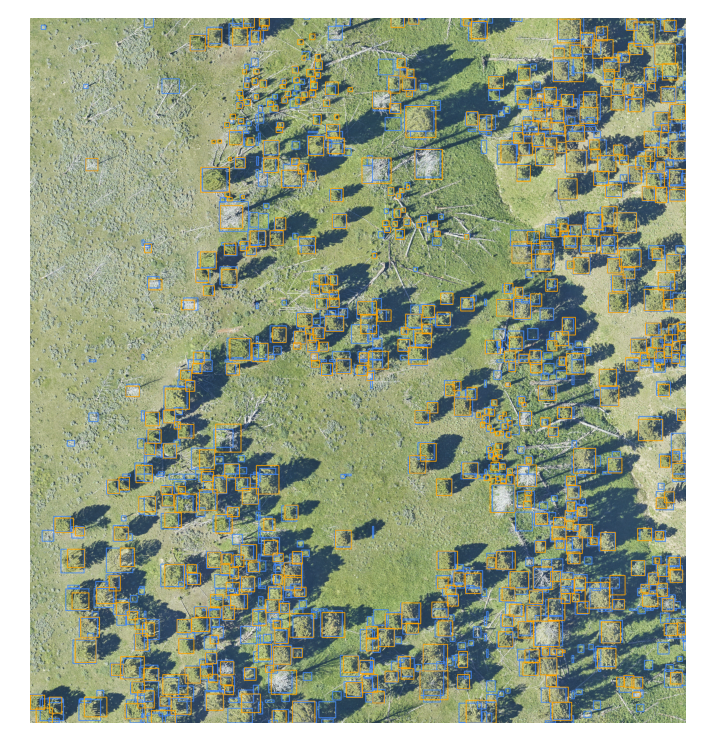

# Visualization

To view the results of DeepForest models, we use Roboflow's [supervision](https://supervision.roboflow.com/latest/) library. Thanks to this team for making a nice set of tools. After making predictions, use :func:`deepforest.visualize.plot_results`.

### Predict

```
from deepforest import main, get_data
from deepforest.visualize import plot_results
import os

model = main.deepforest()
model.use_release()

sample_image_path = get_data("OSBS_029.png")
results = model.predict_image(path=sample_image_path)
plot_results(results, root_dir=os.path.dirname(sample_image_path))
```
The same works with deepforest.main.predict_tile

```
from deepforest import main, get_data
from deepforest.visualize import plot_results
import os

model = main.deepforest()
model.use_release()

img_path = get_data(path="2019_YELL_2_528000_4978000_image_crop2.png")
results = model.predict_tile(img_path, patch_overlap=0, patch_size=400)
# The root dir is the location of the images
root_dir = os.path.dirname(img_path)
plot_results(results, root_dir=root_dir)
```


### Customizing outputs

The colors and thickness of annotations can be updated.

```
# Orange boxes and thicker lines
plot_results(results, root_dir=root_dir, results_color=[109,50,168], thickness=2)
```


### Overlaying predictions and ground truth

```
from deepforest.utilities import read_file
ground_truth = read_file(get_data(path="2019_YELL_2_528000_4978000_image_crop2.xml"))
plot_results(results, root_dir, ground_truth)
```




## Multi-class visualization

For results with more than one predicted class, the plot_results function will detect multiple classes and use a color palette instead of a single class. For control over the color palette see [supervision.draw.color](https://supervision.roboflow.com/draw/color/)

```
color_palette = sv.ColorPalette.from_matplotlib('viridis', 6)
plot_results(results, root_dir, ground_truth, results_color=color_palette)
``
