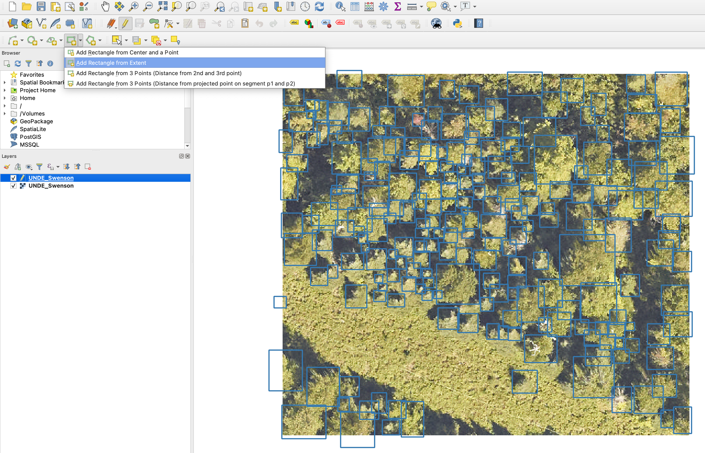

# Annotation
Annotation is likely the most important part of machine learning projects. Fancy models are nice, but data is always paramount. If you aren't happy with model performance, annotating new samples is always the best first idea.

## How should I annotate images?
For quick annotations of a few images, we recommend using QGIS or ArcGIS. Either as project or unprojected data. Create a shapefile for each image.



### Label-studio

For longer term projects, we recommend [label-studio](https://labelstud.io/) as an annotation platform. It has many useful features and is easy to set up.


## Do I need annotate all objects in my image?
Yes! Object detection models use the non-annotated areas of an image as negative data. We know that it can be exceptionally hard to annotate all trees in an image, or determine the classes of all birds in an image. However, if you have objects in the image that are not annotated, the model is learning *to ignore* those portion of the image. This can severely affect model performance.

## Can I annotate points instead of bounding boxes?
Yes. This makes more sense for the bird detection task, as trees tend to vary widely in size. Often, birds will be a standard size compared to the image resolution.

If you would like to train a model, here is a quick video on a simple way to annotate images.

<div style="position: relative; padding-bottom: 62.5%; height: 0;"><iframe src="https://www.loom.com/embed/e1639d36b6ef4118a31b7b892344ba83" frameborder="0" webkitallowfullscreen mozallowfullscreen allowfullscreen style="position: absolute; top: 0; left: 0; width: 100%; height: 100%;"></iframe></div>

Using a shapefile, we could turn it into a dataframe of bounding box annotations by converting the points into boxes. If you already have boxes, you can exclude convert_to_boxes and buffer_size.

```
df = shapefile_to_annotations(
    shapefile="annotations.shp", 
    rgb="image_path", convert_to_boxes=True, buffer_size=0.15
)
```

Optionally, we can split these annotations into crops if the image is large and will not fit into memory. This is often the case.

```
df.to_csv("full_annotations.csv",index=False)
annotations = preprocess.split_raster(
    path_to_raster=image_path,
    annotations_file="full_annotations.csv",
    patch_size=450,
    patch_overlap=0,
    base_dir=directory_to_save_crops,
    allow_empty=False
)
```

## How can I view current predictions as shapefiles?

It is often useful to train new training annotations starting from current predictions. This allows users to more quickly find and correct errors. The following example shows how to create a list of files, predict detections in each, and save as shapefiles. A user can then edit these shapefiles in a program like QGIS.

```
from deepforest import main
from deepforest.visualize import plot_predictions
from deepforest.utilities import boxes_to_shapefile

import rasterio as rio
import geopandas as gpd
from glob import glob
import os
import matplotlib.pyplot as plt
import numpy as np
from shapely import geometry

PATH_TO_DIR = "/Users/benweinstein/Dropbox/Weecology/everglades_species/easyidp/HiddenLittle_03_24_2022"
files = glob("{}/*.JPG".format(PATH_TO_DIR))
m = main.deepforest(label_dict={"Bird":0})
m.use_bird_release()
for path in files:
    #use predict_tile if each object is a orthomosaic
    boxes = m.predict_image(path=path)
    #Open each file and get the geospatial information to convert output into a shapefile
    rio_src = rio.open(path)
    image = rio_src.read()
    
    #Skip empty images
    if boxes is None:
        continue
    
    #View result
    image = np.rollaxis(image, 0, 3)
    fig = plot_predictions(df=boxes, image=image)   
    plt.imshow(fig)
    
    #Create a shapefile, in this case img data was unprojected
    shp = boxes_to_shapefile(boxes, root_dir=PATH_TO_DIR, projected=False)
    
    #Get name of image and save a .shp in the same folder
    basename = os.path.splitext(os.path.basename(path))[0]
    shp.to_file("{}/{}.shp".format(PATH_TO_DIR,basename))
```

## Fast iterations are the key to annotation success

Many projects have a linear concept of annotations with all the annotations collected before model testing. This is often a mistake. Especially in multi-class scenerios, start with a small number of annotations and allow the model to decide which images are most needed. This can be done in an automated way, or simply by looking at confusion matrices and predicted images. Imagine model developement as a pipeline, the more times you can iterate, the more rapidly your model will improve. For an example in airborne wildlife remote sensing, see the excellent paper by [B. Kellenberger et al. 2019](https://ieeexplore.ieee.org/stamp/stamp.jsp?arnumber=8807383&casa_token=ZCCfJk3Fy-IAAAAA:UyZyftM25on1ZUijB1o4gBUWw8JBD5lmVkAvzZqL7PlQTvQMzOIK2n9A73swGUpYZYhARUbw&tag=1).

# Please consider making your annotations open-source!

The DeepForest backbone tree and bird models are not perfect. Please consider posting any annotations you make on zenodo, or sharing them with DeepForest mantainers. Open an [issue](https://github.com/weecology/DeepForest/issues) and tell us about the RGB data and annotations. For example, we are collecting tree annotations to create an [open-source benchmark](https://milliontrees.idtrees.org/). Please consider sharing data to make the models stronger and benefit you and other users. 