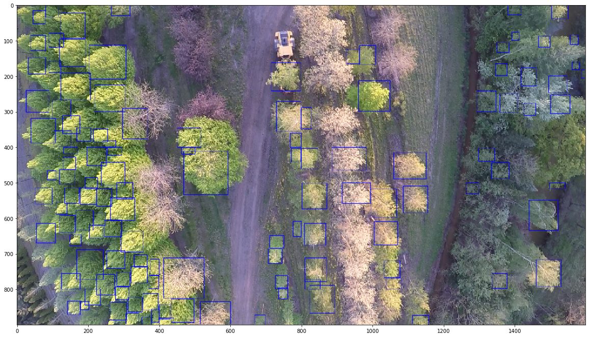
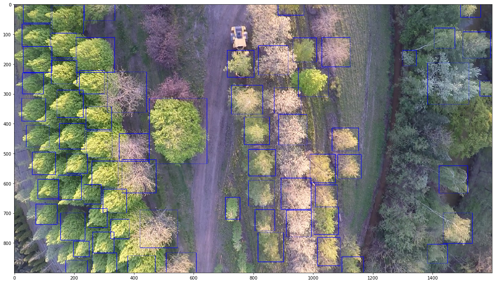

# How do I make the predictions better?

Give the enormous array of forest types and image acquisition environment, it is unlikely that your image will be perfectly predicted by the prebuilt model. Here are some tips to improve predictions

## Check patch size

The prebuilt model was trained on 10cm data at 400px crops. The model is sensitive to predicting to new image resolutions that differ. We have found that increasing the patch size works better on higher quality data. For example, here is a drone collected data at the standard 400px

```python
tile = model.predict_tile("/Users/ben/Desktop/test.jpg",return_plot=True,patch_overlap=0,iou_threshold=0.05,patch_size=400)
```



Acceptable, but not ideal.


Here is 1000 px patches.




improved.

For more on this theme see:
https://github.com/weecology/DeepForest_demos/blob/master/street_tree/StreetTrees.ipynb

The cross-resolution prediction remains an open area of debate and should be explored carefully. For images similar to the 10cm data used to train the release model, keeping a 40m focal view is likely a good choice. For coarser resolutions, the answer will be best found through trial and error, but is almost certainly a wider field of view. This is likely less of an issue if you retrain the model based on data at the desired resolution, rather than directly use the release model to predict trees at novel resolutions.

## IoU threshold

Object detection models have no inherent logic about overlapping bounding box proposals. For tree crown detection, we expect trees in dense forests to have some overlap, but not be completely intertwined. We therefore apply a postprocessing filter called ‘non-max-suppression’, which is a common approach in the broader computer vision literature. This routine starts with the boxes with the highest confidence scores and removes any overlapping boxes greater than the intersection-over-union threshold (IoU). Intersection-over-union is the most common object detection metric, defined as the area of intersection between two boxes divided by the area of union. If users find that there is too much overlap among boxes, increasing the IoU will return fewer boxes. To in-crease the number of overlapping boxes, reduce the IoU threshold.

## Annotate local training data

Ultimately, training a proper model with local data is the best chance at getting good performance. See DeepForest.train()

## Issues

We welcome feedback on both the python package as well as the algorithm performance. Please submit detailed issues to the github repo.

[https://github.com/weecology/DeepForest/issues](https://github.com/weecology/DeepForest/issues)