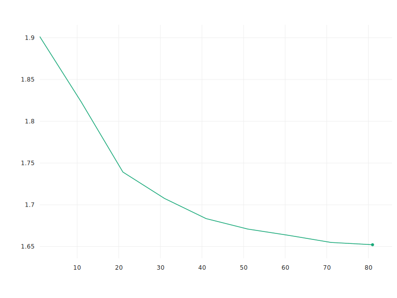

# Case Study - Drones

This is a demonstration notebook of using DeepForest to predict and train models for individual tree segmentation in drone imagery. The goal of this notebook is to orient users to the general DeepForest workflow. Due to data sharing agreements, the data in this example is not available. For more information on the data see the excellent:

Aubry-Kientz, M., Dutrieux, R., Ferraz, A., Saatchi, S., Hamraz, H., Williams, J., Coomes, D., Piboule, A., Vincent, G., 2019. A Comparative Assessment of the Performance of Individual Tree Crowns Delineation Algorithms from ALS Data in Tropical Forests. Remote Sens. 11, 1086. https://doi.org/10.3390/rs11091086

I would like to thank the authors for sharing their data to test deepforest performance.


```python
#Load packages
import numpy as np
from PIL import Image
import os
from matplotlib import pyplot as plt
%matplotlib inline

#Load deepforest
#Optional comet_ml for tracking experiments
from comet_ml import Experiment
from deepforest import deepforest
from deepforest import preprocess
from deepforest import utilities
from deepforest import __version__
#Geospatial packages
import shapely
import geopandas
import rasterio

#Check version
print("This demo is run with deepforest version {}".format(__version__))
```

    Using TensorFlow backend.


    This demo is run with deepforest version 0.2.7


These are version warnings for tensorflow and numpy and can be ignored. Depending on your operating system and specific build, there may be more deprecation warnings. I am happy to field any questions on the DeepForest git repo issues page: https://github.com/weecology/DeepForest/issues  

When faced with a new dataset, the first step is usually test the performance of the prebuilt model. For information on how this model was created see https://deepforest.readthedocs.io/en/latest/getting_started.html

## Load DeepForest prebuilt model

Create a new deepforest object and download the latest release of the prebuilt NEON model from github: https://github.com/weecology/DeepForest/releases


```python
model = deepforest.deepforest()
```

    Reading config file: /Users/ben/Documents/DeepForest_French_Guiana/DeepForest/lib/python3.7/site-packages/deepforest/data/deepforest_config.yml
    A blank deepforest object created. To perform prediction, either train or load an existing model.


These warnings are expected. We have decided not to suppress them in case they conflict with users processes in other codebases. As for DeepForest, they can be safely ignored.


```python
model.use_release()
```

    Model from DeepForest release https://github.com/weecology/DeepForest/releases/tag/v0.2.1 was already downloaded. Loading model from file.
    Loading pre-built model: https://github.com/weecology/DeepForest/releases/tag/v0.2.1
    WARNING:tensorflow:From /Users/ben/Documents/DeepForest_French_Guiana/DeepForest/lib/python3.7/site-packages/keras/backend/tensorflow_backend.py:4070: The name tf.nn.max_pool is deprecated. Please use tf.nn.max_pool2d instead.

    tracking <tf.Variable 'Variable:0' shape=(9, 4) dtype=float32> anchors
    tracking <tf.Variable 'Variable_1:0' shape=(9, 4) dtype=float32> anchors
    tracking <tf.Variable 'Variable_2:0' shape=(9, 4) dtype=float32> anchors
    tracking <tf.Variable 'Variable_3:0' shape=(9, 4) dtype=float32> anchors
    tracking <tf.Variable 'Variable_4:0' shape=(9, 4) dtype=float32> anchors
    WARNING:tensorflow:From /Users/ben/Documents/DeepForest_French_Guiana/DeepForest/lib/python3.7/site-packages/keras_retinanet/backend/tensorflow_backend.py:104: add_dispatch_support.<locals>.wrapper (from tensorflow.python.ops.array_ops) is deprecated and will be removed in a future version.
    Instructions for updating:
    Use tf.where in 2.0, which has the same broadcast rule as np.where


```python
model.__release_version__
```


    'https://github.com/weecology/DeepForest/releases/tag/v0.2.1'


## Load RGB Raster

It is often useful to look at small piece of a large tile before performing predict_tile


```python
raster_path = "/Users/ben/Dropbox/Weecology/Drone/ForBen/RGB_allPlots/RetroProj_cropped/RP_2015_P15.tif"
raster = Image.open(raster_path)
numpy_image = np.array(raster)
numpy_image.shape
```


    (3470, 3530, 3)


Our image is 3440 by 3440 pixels with 3 channels

### Crop a small window


```python
windows = preprocess.compute_windows(numpy_image, patch_size=400,patch_overlap=0.1)
```

windows is a sliding window object that holds the position of each crop


```python
index = 9
crop = numpy_image[windows[index].indices()]
crop.shape
plt.imshow(crop)
```


    <matplotlib.image.AxesImage at 0x151e0ee10>


### Change from RGB to BGR channel order

Matplotlib and OpenCV differ in default channel orders. Using Image.open will yield RGB images, whereas keras-retinanet expects BGR images. Flip channel order using numpy.


```python
crop = crop[...,::-1] #keras-retinanet requires bluegreered channel order
```

## Predict from the prebuilt model


```python
prediction = model.predict_image(raw_image = crop,return_plot=True, score_threshold=0.05)
```

    WARNING:tensorflow:From /Users/ben/Documents/DeepForest_French_Guiana/DeepForest/lib/python3.7/site-packages/keras/backend/tensorflow_backend.py:422: The name tf.global_variables is deprecated. Please use tf.compat.v1.global_variables instead.


```python
plt.imshow(prediction[...,::-1]) #show in rgb channel order
```


    <matplotlib.image.AxesImage at 0x1516ff350>


To get the bounding boxes as a dataframe, use return_plot=False


```python
prediction_boxes = model.predict_image(raw_image = crop,return_plot=False, score_threshold=0.05)
```


```python
prediction_boxes.head()
```


<div>
<style scoped>
    .dataframe tbody tr th:only-of-type {
        vertical-align: middle;
    }

    .dataframe tbody tr th {
        vertical-align: top;
    }

    .dataframe thead th {
        text-align: right;
    }
</style>
<table border="1" class="dataframe">
  <thead>
    <tr style="text-align: right;">
      <th></th>
      <th>xmin</th>
      <th>ymin</th>
      <th>xmax</th>
      <th>ymax</th>
      <th>score</th>
      <th>label</th>
    </tr>
  </thead>
  <tbody>
    <tr>
      <th>0</th>
      <td>314.474884</td>
      <td>248.668076</td>
      <td>371.648193</td>
      <td>304.204193</td>
      <td>0.700159</td>
      <td>Tree</td>
    </tr>
    <tr>
      <th>1</th>
      <td>317.331421</td>
      <td>308.574402</td>
      <td>364.592255</td>
      <td>357.247406</td>
      <td>0.686024</td>
      <td>Tree</td>
    </tr>
    <tr>
      <th>2</th>
      <td>172.521942</td>
      <td>170.743179</td>
      <td>236.104370</td>
      <td>237.100296</td>
      <td>0.679066</td>
      <td>Tree</td>
    </tr>
    <tr>
      <th>3</th>
      <td>180.300705</td>
      <td>79.773674</td>
      <td>241.513123</td>
      <td>142.817734</td>
      <td>0.639935</td>
      <td>Tree</td>
    </tr>
    <tr>
      <th>4</th>
      <td>228.626373</td>
      <td>153.100372</td>
      <td>267.252045</td>
      <td>196.547791</td>
      <td>0.639300</td>
      <td>Tree</td>
    </tr>
  </tbody>
</table>
</div>


```python
prediction_boxes.shape
```


    (75, 6)


```python
fig, axes, = plt.subplots(nrows=4,ncols=3, figsize=(30,30))
axes = axes.flatten()
for index in range(12):
    crop = numpy_image[windows[index].indices()]
    #predict in bgr channel order
    prediction = model.predict_image(raw_image = crop[...,::-1],return_plot=True, score_threshold=0.05)
    #but plot in rgb channel order
    axes[index].imshow(prediction[...,::-1])
```


## Predict entire tile

The overall tile is too large to fit into memory. DeepForest will slide overlapping windows, same as the sized above, make a prediction on each window. Then reassemble and delete overlaps based on the highest scoring box. The reassembling process can be subtle, and requires the user to balance the amount of overlap (more predictions = slower), and the overall size of objects on interest.


```python
tile = model.predict_tile(raster_path,return_plot=True,patch_overlap=0.3,iou_threshold=0.2)
```

    WARNING:tensorflow:From /Users/ben/Documents/DeepForest_French_Guiana/DeepForest/lib/python3.7/site-packages/deepforest/deepforest.py:324: The name tf.Session is deprecated. Please use tf.compat.v1.Session instead.

    10724 predictions in overlapping windows, applying non-max supression
    5422 predictions kept after non-max suppression


```python
fig = plt.figure(figsize=(100,100))
plt.imshow(tile)
plt.savefig("/Users/Ben/Desktop/overlap30_iou20.png")
```


### Create shapefile of predictions

For this particular use case, we are interested in taking the bounding boxes and making a shapefile of bounding boxes. This section requires dependencies outside of DeepForest, and in particular geopandas can be annoying to install on windows due to GDAL. For this reason, these packages are not included in the main DeepForest install.


```python
boxes = model.predict_tile(raster_path,return_plot=False,patch_overlap=0.2,iou_threshold=0.2)
```

    8382 predictions in overlapping windows, applying non-max supression
    5312 predictions kept after non-max suppression


```python
#Georeference.
#This isn't a true projection, but over small spatial scales it will be fine. Add the origin of the raster and multiply the box height and width by the cell size (m/cell).
#read in extent using rasterio
with rasterio.open(raster_path) as dataset:
    bounds = dataset.bounds
    pixelSizeX, pixelSizeY  = dataset.res

#subtract origin. Recall that numpy origin is top left! Not bottom left.
boxes["xmin"] = (boxes["xmin"] *pixelSizeX) + bounds.left
boxes["xmax"] = (boxes["xmax"] * pixelSizeX) + bounds.left
boxes["ymin"] = bounds.top - (boxes["ymin"] * pixelSizeY)
boxes["ymax"] = bounds.top - (boxes["ymax"] * pixelSizeY)
```


```python
# combine column to a shapely Box() object, save shapefile
boxes['geometry'] = boxes.apply(lambda x: shapely.geometry.box(x.xmin,x.ymin,x.xmax,x.ymax), axis=1)
boxes = geopandas.GeoDataFrame(boxes, geometry='geometry')

#set projection, (see dataset.crs) hard coded here
boxes.crs = {'init' :'epsg:32622'}
#get proj info see:https://gis.stackexchange.com/questions/204201/geopandas-to-file-saves-geodataframe-without-coordinate-system
prj = 'PROJCS["WGS_1984_UTM_Zone_22N",GEOGCS["GCS_WGS_1984",DATUM["D_WGS_1984",SPHEROID["WGS_1984",6378137,298.257223563]],PRIMEM["Greenwich",0],UNIT["Degree",0.017453292519943295]],PROJECTION["Transverse_Mercator"],PARAMETER["latitude_of_origin",0],PARAMETER["central_meridian",-51],PARAMETER["scale_factor",0.9996],PARAMETER["false_easting",500000],PARAMETER["false_northing",0],UNIT["Meter",1]]'
boxes.to_file('PrebuiltModel.shp', driver='ESRI Shapefile',crs_wkt=prj)
```

## Train Model

Beginning from the prebuilt model test above, we can train a model based on annotations from the study site in question. A seperate tile was hand-annotated using the program rectlabel. See https://deepforest.readthedocs.io/en/latest/training.html. There is no fixed number of annotations needed, it depends on the variability of the target dataset. Our experience is that ~1000 crowns is a good starting point. See Figure 8 from https://www.biorxiv.org/content/10.1101/790071v1.full. This example took about 4 hours to annotate.


Training configurations are stored in a deepforest_config.yml in the local directory, or a default config is used from install. These parameters can be accessed at runtime as well


```python
model.config
```


    {'batch_size': 1,
     'weights': '/Users/ben/Documents/DeepForest_French_Guiana/DeepForest/lib/python3.7/site-packages/deepforest/data/NEON.h5',
     'backbone': 'resnet50',
     'image-min-side': 800,
     'multi-gpu': 1,
     'epochs': 1,
     'validation_annotations': 'None',
     'freeze_layers': 0,
     'freeze_resnet': False,
     'score_threshold': 0.05,
     'multiprocessing': False,
     'workers': 1,
     'max_queue_size': 10,
     'random_transform': False,
     'save-snapshot': False,
     'save_path': 'snapshots/',
     'snapshot_path': 'snapshots/'}


For more information on the parameter settings see https://deepforest.readthedocs.io/en/latest/training_config.html

### Prepare annotation data for training

DeepForest trains on 400x400 pixel windows. The overall image is too large to fit into memory. We therefore need to split the annotations into windows and generate the crops for training


```python
#Read xml and create pandas frame
annotation = utilities.xml_to_annotations("/Users/ben/Dropbox/Weecology/Drone/RP_2015_P1.xml")
annotation.head()

#Write converted dataframe to file. Saved alongside the images
annotation.to_csv("FG_example.csv", index=False)


#Where to save cropped images
crop_dir = "crops/"
train_annotations= preprocess.split_raster(path_to_raster="/Users/ben/Dropbox/Weecology/Drone/ForBen/RGB_allPlots/RetroProj_cropped/RP_2015_P1.tif",
                                 annotations_file="FG_example.csv",
                                 base_dir=crop_dir,
                                 patch_size=400,
                                 patch_overlap=0.05)

#Split image crops into training and test. Normally these would be different tiles! Just as an example.
image_paths = train_annotations.image_path.unique()
test_paths = np.random.choice(image_paths, 3)
test_annotations = train_annotations.loc[train_annotations.image_path.isin(test_paths)]
train_annotations = train_annotations.loc[~train_annotations.image_path.isin(test_paths)]

#View output
train_annotations.head()
print("There are {} training crown annotations".format(train_annotations.shape[0]))
print("There are {} test crown annotations".format(test_annotations.shape[0]))

#save to file
#Write window annotations file without a header row, same location as the "base_dir" above.
train_annotations.to_csv(crop_dir + "train.csv",index=False,header=False)
test_annotations.to_csv(crop_dir + "test.csv",index=False,header=False)

annotations_file= crop_dir + "train.csv"
test_file= crop_dir + "test.csv"

#Add the test annotations to the config, see https://deepforest.readthedocs.io/en/latest/training_config.html#validation-annotations-none
model.config["validation_annotations"] = test_file

```

    There are 1750 training crown annotations
    There are 42 test crown annotations


Before training lets get a bit of a baseline by getting the evaluation score on the test file using the prebuilt model.


```python
model.evaluate_generator(test_file)
```

    Running network: N/A% (0 of 2) |         | Elapsed Time: 0:00:00 ETA:  --:--:--

    There are 1 unique labels: ['Tree']
    Disabling snapshot saving


    Running network: 100% (2 of 2) |#########| Elapsed Time: 0:00:03 Time:  0:00:03
    Parsing annotations: 100% (2 of 2) |#####| Elapsed Time: 0:00:00 Time:  0:00:00


    42 instances of class Tree with average precision: 0.3454
    mAP using the weighted average of precisions among classes: 0.3454
    mAP: 0.3454


    0.34535418112634


Optionally create a comet experiment. Comet is a machine learning visualization dashboard with great tools and project tracking. There is a free tier for academics.


```python
comet_experiment = Experiment(api_key="ypQZhYfs3nSyKzOfz13iuJpj2",
                                  project_name="frenchguiana", workspace="bw4sz")

comet_experiment.log_parameters(model.config)
```

    COMET INFO: old comet version (3.0.1) detected. current: 3.0.2 please update your comet lib with command: `pip install --no-cache-dir --upgrade comet_ml`
    COMET INFO: Experiment is live on comet.ml https://www.comet.ml/bw4sz/frenchguiana/8c249285fdc048fc85ae982b22513ea8


```python
model.train(annotations=annotations_file,input_type="fit_generator",comet_experiment=comet_experiment)
comet_experiment.end()
```

    There are 1 unique labels: ['Tree']
    Disabling snapshot saving
    Training retinanet with the following args ['--weights', '/Users/ben/Documents/DeepForest_French_Guiana/DeepForest/lib/python3.7/site-packages/deepforest/data/NEON.h5', '--backbone', 'resnet50', '--image-min-side', '800', '--multi-gpu', '1', '--epochs', '1', '--steps', '79', '--batch-size', '1', '--tensorboard-dir', 'None', '--workers', '1', '--max-queue-size', '10', '--freeze-layers', '0', '--score-threshold', '0.05', '--save-path', 'snapshots/', '--snapshot-path', 'snapshots/', '--no-snapshots', 'csv', 'crops/train.csv', 'crops/classes.csv', '--val-annotations', 'crops/test.csv']
    Creating model, this may take a second...
    tracking <tf.Variable 'Variable_5:0' shape=(9, 4) dtype=float32> anchors
    tracking <tf.Variable 'Variable_6:0' shape=(9, 4) dtype=float32> anchors
    tracking <tf.Variable 'Variable_7:0' shape=(9, 4) dtype=float32> anchors
    tracking <tf.Variable 'Variable_8:0' shape=(9, 4) dtype=float32> anchors
    tracking <tf.Variable 'Variable_9:0' shape=(9, 4) dtype=float32> anchors
    Model: "retinanet"
    __________________________________________________________________________________________________
    Layer (type)                    Output Shape         Param #     Connected to                     
    ==================================================================================================
    input_1 (InputLayer)            (None, None, None, 3 0                                            
    __________________________________________________________________________________________________
    padding_conv1 (ZeroPadding2D)   (None, None, None, 3 0           input_1[0][0]                    
    __________________________________________________________________________________________________
    conv1 (Conv2D)                  (None, None, None, 6 9408        padding_conv1[0][0]              
    __________________________________________________________________________________________________
    bn_conv1 (BatchNormalization)   (None, None, None, 6 256         conv1[0][0]                      
    __________________________________________________________________________________________________
    conv1_relu (Activation)         (None, None, None, 6 0           bn_conv1[0][0]                   
    __________________________________________________________________________________________________
    pool1 (MaxPooling2D)            (None, None, None, 6 0           conv1_relu[0][0]                 
    __________________________________________________________________________________________________
    res2a_branch2a (Conv2D)         (None, None, None, 6 4096        pool1[0][0]                      
    __________________________________________________________________________________________________
    bn2a_branch2a (BatchNormalizati (None, None, None, 6 256         res2a_branch2a[0][0]             
    __________________________________________________________________________________________________
    res2a_branch2a_relu (Activation (None, None, None, 6 0           bn2a_branch2a[0][0]              
    __________________________________________________________________________________________________
    padding2a_branch2b (ZeroPadding (None, None, None, 6 0           res2a_branch2a_relu[0][0]        
    __________________________________________________________________________________________________
    res2a_branch2b (Conv2D)         (None, None, None, 6 36864       padding2a_branch2b[0][0]         
    __________________________________________________________________________________________________
    bn2a_branch2b (BatchNormalizati (None, None, None, 6 256         res2a_branch2b[0][0]             
    __________________________________________________________________________________________________
    res2a_branch2b_relu (Activation (None, None, None, 6 0           bn2a_branch2b[0][0]              
    __________________________________________________________________________________________________
    res2a_branch2c (Conv2D)         (None, None, None, 2 16384       res2a_branch2b_relu[0][0]        
    __________________________________________________________________________________________________
    res2a_branch1 (Conv2D)          (None, None, None, 2 16384       pool1[0][0]                      
    __________________________________________________________________________________________________
    bn2a_branch2c (BatchNormalizati (None, None, None, 2 1024        res2a_branch2c[0][0]             
    __________________________________________________________________________________________________
    bn2a_branch1 (BatchNormalizatio (None, None, None, 2 1024        res2a_branch1[0][0]              
    __________________________________________________________________________________________________
    res2a (Add)                     (None, None, None, 2 0           bn2a_branch2c[0][0]              
                                                                     bn2a_branch1[0][0]               
    __________________________________________________________________________________________________
    res2a_relu (Activation)         (None, None, None, 2 0           res2a[0][0]                      
    __________________________________________________________________________________________________
    res2b_branch2a (Conv2D)         (None, None, None, 6 16384       res2a_relu[0][0]                 
    __________________________________________________________________________________________________
    bn2b_branch2a (BatchNormalizati (None, None, None, 6 256         res2b_branch2a[0][0]             
    __________________________________________________________________________________________________
    res2b_branch2a_relu (Activation (None, None, None, 6 0           bn2b_branch2a[0][0]              
    __________________________________________________________________________________________________
    padding2b_branch2b (ZeroPadding (None, None, None, 6 0           res2b_branch2a_relu[0][0]        
    __________________________________________________________________________________________________
    res2b_branch2b (Conv2D)         (None, None, None, 6 36864       padding2b_branch2b[0][0]         
    __________________________________________________________________________________________________
    bn2b_branch2b (BatchNormalizati (None, None, None, 6 256         res2b_branch2b[0][0]             
    __________________________________________________________________________________________________
    res2b_branch2b_relu (Activation (None, None, None, 6 0           bn2b_branch2b[0][0]              
    __________________________________________________________________________________________________
    res2b_branch2c (Conv2D)         (None, None, None, 2 16384       res2b_branch2b_relu[0][0]        
    __________________________________________________________________________________________________
    bn2b_branch2c (BatchNormalizati (None, None, None, 2 1024        res2b_branch2c[0][0]             
    __________________________________________________________________________________________________
    res2b (Add)                     (None, None, None, 2 0           bn2b_branch2c[0][0]              
                                                                     res2a_relu[0][0]                 
    __________________________________________________________________________________________________
    res2b_relu (Activation)         (None, None, None, 2 0           res2b[0][0]                      
    __________________________________________________________________________________________________
    res2c_branch2a (Conv2D)         (None, None, None, 6 16384       res2b_relu[0][0]                 
    __________________________________________________________________________________________________
    bn2c_branch2a (BatchNormalizati (None, None, None, 6 256         res2c_branch2a[0][0]             
    __________________________________________________________________________________________________
    res2c_branch2a_relu (Activation (None, None, None, 6 0           bn2c_branch2a[0][0]              
    __________________________________________________________________________________________________
    padding2c_branch2b (ZeroPadding (None, None, None, 6 0           res2c_branch2a_relu[0][0]        
    __________________________________________________________________________________________________
    res2c_branch2b (Conv2D)         (None, None, None, 6 36864       padding2c_branch2b[0][0]         
    __________________________________________________________________________________________________
    bn2c_branch2b (BatchNormalizati (None, None, None, 6 256         res2c_branch2b[0][0]             
    __________________________________________________________________________________________________
    res2c_branch2b_relu (Activation (None, None, None, 6 0           bn2c_branch2b[0][0]              
    __________________________________________________________________________________________________
    res2c_branch2c (Conv2D)         (None, None, None, 2 16384       res2c_branch2b_relu[0][0]        
    __________________________________________________________________________________________________
    bn2c_branch2c (BatchNormalizati (None, None, None, 2 1024        res2c_branch2c[0][0]             
    __________________________________________________________________________________________________
    res2c (Add)                     (None, None, None, 2 0           bn2c_branch2c[0][0]              
                                                                     res2b_relu[0][0]                 
    __________________________________________________________________________________________________
    res2c_relu (Activation)         (None, None, None, 2 0           res2c[0][0]                      
    __________________________________________________________________________________________________
    res3a_branch2a (Conv2D)         (None, None, None, 1 32768       res2c_relu[0][0]                 
    __________________________________________________________________________________________________
    bn3a_branch2a (BatchNormalizati (None, None, None, 1 512         res3a_branch2a[0][0]             
    __________________________________________________________________________________________________
    res3a_branch2a_relu (Activation (None, None, None, 1 0           bn3a_branch2a[0][0]              
    __________________________________________________________________________________________________
    padding3a_branch2b (ZeroPadding (None, None, None, 1 0           res3a_branch2a_relu[0][0]        
    __________________________________________________________________________________________________
    res3a_branch2b (Conv2D)         (None, None, None, 1 147456      padding3a_branch2b[0][0]         
    __________________________________________________________________________________________________
    bn3a_branch2b (BatchNormalizati (None, None, None, 1 512         res3a_branch2b[0][0]             
    __________________________________________________________________________________________________
    res3a_branch2b_relu (Activation (None, None, None, 1 0           bn3a_branch2b[0][0]              
    __________________________________________________________________________________________________
    res3a_branch2c (Conv2D)         (None, None, None, 5 65536       res3a_branch2b_relu[0][0]        
    __________________________________________________________________________________________________
    res3a_branch1 (Conv2D)          (None, None, None, 5 131072      res2c_relu[0][0]                 
    __________________________________________________________________________________________________
    bn3a_branch2c (BatchNormalizati (None, None, None, 5 2048        res3a_branch2c[0][0]             
    __________________________________________________________________________________________________
    bn3a_branch1 (BatchNormalizatio (None, None, None, 5 2048        res3a_branch1[0][0]              
    __________________________________________________________________________________________________
    res3a (Add)                     (None, None, None, 5 0           bn3a_branch2c[0][0]              
                                                                     bn3a_branch1[0][0]               
    __________________________________________________________________________________________________
    res3a_relu (Activation)         (None, None, None, 5 0           res3a[0][0]                      
    __________________________________________________________________________________________________
    res3b_branch2a (Conv2D)         (None, None, None, 1 65536       res3a_relu[0][0]                 
    __________________________________________________________________________________________________
    bn3b_branch2a (BatchNormalizati (None, None, None, 1 512         res3b_branch2a[0][0]             
    __________________________________________________________________________________________________
    res3b_branch2a_relu (Activation (None, None, None, 1 0           bn3b_branch2a[0][0]              
    __________________________________________________________________________________________________
    padding3b_branch2b (ZeroPadding (None, None, None, 1 0           res3b_branch2a_relu[0][0]        
    __________________________________________________________________________________________________
    res3b_branch2b (Conv2D)         (None, None, None, 1 147456      padding3b_branch2b[0][0]         
    __________________________________________________________________________________________________
    bn3b_branch2b (BatchNormalizati (None, None, None, 1 512         res3b_branch2b[0][0]             
    __________________________________________________________________________________________________
    res3b_branch2b_relu (Activation (None, None, None, 1 0           bn3b_branch2b[0][0]              
    __________________________________________________________________________________________________
    res3b_branch2c (Conv2D)         (None, None, None, 5 65536       res3b_branch2b_relu[0][0]        
    __________________________________________________________________________________________________
    bn3b_branch2c (BatchNormalizati (None, None, None, 5 2048        res3b_branch2c[0][0]             
    __________________________________________________________________________________________________
    res3b (Add)                     (None, None, None, 5 0           bn3b_branch2c[0][0]              
                                                                     res3a_relu[0][0]                 
    __________________________________________________________________________________________________
    res3b_relu (Activation)         (None, None, None, 5 0           res3b[0][0]                      
    __________________________________________________________________________________________________
    res3c_branch2a (Conv2D)         (None, None, None, 1 65536       res3b_relu[0][0]                 
    __________________________________________________________________________________________________
    bn3c_branch2a (BatchNormalizati (None, None, None, 1 512         res3c_branch2a[0][0]             
    __________________________________________________________________________________________________
    res3c_branch2a_relu (Activation (None, None, None, 1 0           bn3c_branch2a[0][0]              
    __________________________________________________________________________________________________
    padding3c_branch2b (ZeroPadding (None, None, None, 1 0           res3c_branch2a_relu[0][0]        
    __________________________________________________________________________________________________
    res3c_branch2b (Conv2D)         (None, None, None, 1 147456      padding3c_branch2b[0][0]         
    __________________________________________________________________________________________________
    bn3c_branch2b (BatchNormalizati (None, None, None, 1 512         res3c_branch2b[0][0]             
    __________________________________________________________________________________________________
    res3c_branch2b_relu (Activation (None, None, None, 1 0           bn3c_branch2b[0][0]              
    __________________________________________________________________________________________________
    res3c_branch2c (Conv2D)         (None, None, None, 5 65536       res3c_branch2b_relu[0][0]        
    __________________________________________________________________________________________________
    bn3c_branch2c (BatchNormalizati (None, None, None, 5 2048        res3c_branch2c[0][0]             
    __________________________________________________________________________________________________
    res3c (Add)                     (None, None, None, 5 0           bn3c_branch2c[0][0]              
                                                                     res3b_relu[0][0]                 
    __________________________________________________________________________________________________
    res3c_relu (Activation)         (None, None, None, 5 0           res3c[0][0]                      
    __________________________________________________________________________________________________
    res3d_branch2a (Conv2D)         (None, None, None, 1 65536       res3c_relu[0][0]                 
    __________________________________________________________________________________________________
    bn3d_branch2a (BatchNormalizati (None, None, None, 1 512         res3d_branch2a[0][0]             
    __________________________________________________________________________________________________
    res3d_branch2a_relu (Activation (None, None, None, 1 0           bn3d_branch2a[0][0]              
    __________________________________________________________________________________________________
    padding3d_branch2b (ZeroPadding (None, None, None, 1 0           res3d_branch2a_relu[0][0]        
    __________________________________________________________________________________________________
    res3d_branch2b (Conv2D)         (None, None, None, 1 147456      padding3d_branch2b[0][0]         
    __________________________________________________________________________________________________
    bn3d_branch2b (BatchNormalizati (None, None, None, 1 512         res3d_branch2b[0][0]             
    __________________________________________________________________________________________________
    res3d_branch2b_relu (Activation (None, None, None, 1 0           bn3d_branch2b[0][0]              
    __________________________________________________________________________________________________
    res3d_branch2c (Conv2D)         (None, None, None, 5 65536       res3d_branch2b_relu[0][0]        
    __________________________________________________________________________________________________
    bn3d_branch2c (BatchNormalizati (None, None, None, 5 2048        res3d_branch2c[0][0]             
    __________________________________________________________________________________________________
    res3d (Add)                     (None, None, None, 5 0           bn3d_branch2c[0][0]              
                                                                     res3c_relu[0][0]                 
    __________________________________________________________________________________________________
    res3d_relu (Activation)         (None, None, None, 5 0           res3d[0][0]                      
    __________________________________________________________________________________________________
    res4a_branch2a (Conv2D)         (None, None, None, 2 131072      res3d_relu[0][0]                 
    __________________________________________________________________________________________________
    bn4a_branch2a (BatchNormalizati (None, None, None, 2 1024        res4a_branch2a[0][0]             
    __________________________________________________________________________________________________
    res4a_branch2a_relu (Activation (None, None, None, 2 0           bn4a_branch2a[0][0]              
    __________________________________________________________________________________________________
    padding4a_branch2b (ZeroPadding (None, None, None, 2 0           res4a_branch2a_relu[0][0]        
    __________________________________________________________________________________________________
    res4a_branch2b (Conv2D)         (None, None, None, 2 589824      padding4a_branch2b[0][0]         
    __________________________________________________________________________________________________
    bn4a_branch2b (BatchNormalizati (None, None, None, 2 1024        res4a_branch2b[0][0]             
    __________________________________________________________________________________________________
    res4a_branch2b_relu (Activation (None, None, None, 2 0           bn4a_branch2b[0][0]              
    __________________________________________________________________________________________________
    res4a_branch2c (Conv2D)         (None, None, None, 1 262144      res4a_branch2b_relu[0][0]        
    __________________________________________________________________________________________________
    res4a_branch1 (Conv2D)          (None, None, None, 1 524288      res3d_relu[0][0]                 
    __________________________________________________________________________________________________
    bn4a_branch2c (BatchNormalizati (None, None, None, 1 4096        res4a_branch2c[0][0]             
    __________________________________________________________________________________________________
    bn4a_branch1 (BatchNormalizatio (None, None, None, 1 4096        res4a_branch1[0][0]              
    __________________________________________________________________________________________________
    res4a (Add)                     (None, None, None, 1 0           bn4a_branch2c[0][0]              
                                                                     bn4a_branch1[0][0]               
    __________________________________________________________________________________________________
    res4a_relu (Activation)         (None, None, None, 1 0           res4a[0][0]                      
    __________________________________________________________________________________________________
    res4b_branch2a (Conv2D)         (None, None, None, 2 262144      res4a_relu[0][0]                 
    __________________________________________________________________________________________________
    bn4b_branch2a (BatchNormalizati (None, None, None, 2 1024        res4b_branch2a[0][0]             
    __________________________________________________________________________________________________
    res4b_branch2a_relu (Activation (None, None, None, 2 0           bn4b_branch2a[0][0]              
    __________________________________________________________________________________________________
    padding4b_branch2b (ZeroPadding (None, None, None, 2 0           res4b_branch2a_relu[0][0]        
    __________________________________________________________________________________________________
    res4b_branch2b (Conv2D)         (None, None, None, 2 589824      padding4b_branch2b[0][0]         
    __________________________________________________________________________________________________
    bn4b_branch2b (BatchNormalizati (None, None, None, 2 1024        res4b_branch2b[0][0]             
    __________________________________________________________________________________________________
    res4b_branch2b_relu (Activation (None, None, None, 2 0           bn4b_branch2b[0][0]              
    __________________________________________________________________________________________________
    res4b_branch2c (Conv2D)         (None, None, None, 1 262144      res4b_branch2b_relu[0][0]        
    __________________________________________________________________________________________________
    bn4b_branch2c (BatchNormalizati (None, None, None, 1 4096        res4b_branch2c[0][0]             
    __________________________________________________________________________________________________
    res4b (Add)                     (None, None, None, 1 0           bn4b_branch2c[0][0]              
                                                                     res4a_relu[0][0]                 
    __________________________________________________________________________________________________
    res4b_relu (Activation)         (None, None, None, 1 0           res4b[0][0]                      
    __________________________________________________________________________________________________
    res4c_branch2a (Conv2D)         (None, None, None, 2 262144      res4b_relu[0][0]                 
    __________________________________________________________________________________________________
    bn4c_branch2a (BatchNormalizati (None, None, None, 2 1024        res4c_branch2a[0][0]             
    __________________________________________________________________________________________________
    res4c_branch2a_relu (Activation (None, None, None, 2 0           bn4c_branch2a[0][0]              
    __________________________________________________________________________________________________
    padding4c_branch2b (ZeroPadding (None, None, None, 2 0           res4c_branch2a_relu[0][0]        
    __________________________________________________________________________________________________
    res4c_branch2b (Conv2D)         (None, None, None, 2 589824      padding4c_branch2b[0][0]         
    __________________________________________________________________________________________________
    bn4c_branch2b (BatchNormalizati (None, None, None, 2 1024        res4c_branch2b[0][0]             
    __________________________________________________________________________________________________
    res4c_branch2b_relu (Activation (None, None, None, 2 0           bn4c_branch2b[0][0]              
    __________________________________________________________________________________________________
    res4c_branch2c (Conv2D)         (None, None, None, 1 262144      res4c_branch2b_relu[0][0]        
    __________________________________________________________________________________________________
    bn4c_branch2c (BatchNormalizati (None, None, None, 1 4096        res4c_branch2c[0][0]             
    __________________________________________________________________________________________________
    res4c (Add)                     (None, None, None, 1 0           bn4c_branch2c[0][0]              
                                                                     res4b_relu[0][0]                 
    __________________________________________________________________________________________________
    res4c_relu (Activation)         (None, None, None, 1 0           res4c[0][0]                      
    __________________________________________________________________________________________________
    res4d_branch2a (Conv2D)         (None, None, None, 2 262144      res4c_relu[0][0]                 
    __________________________________________________________________________________________________
    bn4d_branch2a (BatchNormalizati (None, None, None, 2 1024        res4d_branch2a[0][0]             
    __________________________________________________________________________________________________
    res4d_branch2a_relu (Activation (None, None, None, 2 0           bn4d_branch2a[0][0]              
    __________________________________________________________________________________________________
    padding4d_branch2b (ZeroPadding (None, None, None, 2 0           res4d_branch2a_relu[0][0]        
    __________________________________________________________________________________________________
    res4d_branch2b (Conv2D)         (None, None, None, 2 589824      padding4d_branch2b[0][0]         
    __________________________________________________________________________________________________
    bn4d_branch2b (BatchNormalizati (None, None, None, 2 1024        res4d_branch2b[0][0]             
    __________________________________________________________________________________________________
    res4d_branch2b_relu (Activation (None, None, None, 2 0           bn4d_branch2b[0][0]              
    __________________________________________________________________________________________________
    res4d_branch2c (Conv2D)         (None, None, None, 1 262144      res4d_branch2b_relu[0][0]        
    __________________________________________________________________________________________________
    bn4d_branch2c (BatchNormalizati (None, None, None, 1 4096        res4d_branch2c[0][0]             
    __________________________________________________________________________________________________
    res4d (Add)                     (None, None, None, 1 0           bn4d_branch2c[0][0]              
                                                                     res4c_relu[0][0]                 
    __________________________________________________________________________________________________
    res4d_relu (Activation)         (None, None, None, 1 0           res4d[0][0]                      
    __________________________________________________________________________________________________
    res4e_branch2a (Conv2D)         (None, None, None, 2 262144      res4d_relu[0][0]                 
    __________________________________________________________________________________________________
    bn4e_branch2a (BatchNormalizati (None, None, None, 2 1024        res4e_branch2a[0][0]             
    __________________________________________________________________________________________________
    res4e_branch2a_relu (Activation (None, None, None, 2 0           bn4e_branch2a[0][0]              
    __________________________________________________________________________________________________
    padding4e_branch2b (ZeroPadding (None, None, None, 2 0           res4e_branch2a_relu[0][0]        
    __________________________________________________________________________________________________
    res4e_branch2b (Conv2D)         (None, None, None, 2 589824      padding4e_branch2b[0][0]         
    __________________________________________________________________________________________________
    bn4e_branch2b (BatchNormalizati (None, None, None, 2 1024        res4e_branch2b[0][0]             
    __________________________________________________________________________________________________
    res4e_branch2b_relu (Activation (None, None, None, 2 0           bn4e_branch2b[0][0]              
    __________________________________________________________________________________________________
    res4e_branch2c (Conv2D)         (None, None, None, 1 262144      res4e_branch2b_relu[0][0]        
    __________________________________________________________________________________________________
    bn4e_branch2c (BatchNormalizati (None, None, None, 1 4096        res4e_branch2c[0][0]             
    __________________________________________________________________________________________________
    res4e (Add)                     (None, None, None, 1 0           bn4e_branch2c[0][0]              
                                                                     res4d_relu[0][0]                 
    __________________________________________________________________________________________________
    res4e_relu (Activation)         (None, None, None, 1 0           res4e[0][0]                      
    __________________________________________________________________________________________________
    res4f_branch2a (Conv2D)         (None, None, None, 2 262144      res4e_relu[0][0]                 
    __________________________________________________________________________________________________
    bn4f_branch2a (BatchNormalizati (None, None, None, 2 1024        res4f_branch2a[0][0]             
    __________________________________________________________________________________________________
    res4f_branch2a_relu (Activation (None, None, None, 2 0           bn4f_branch2a[0][0]              
    __________________________________________________________________________________________________
    padding4f_branch2b (ZeroPadding (None, None, None, 2 0           res4f_branch2a_relu[0][0]        
    __________________________________________________________________________________________________
    res4f_branch2b (Conv2D)         (None, None, None, 2 589824      padding4f_branch2b[0][0]         
    __________________________________________________________________________________________________
    bn4f_branch2b (BatchNormalizati (None, None, None, 2 1024        res4f_branch2b[0][0]             
    __________________________________________________________________________________________________
    res4f_branch2b_relu (Activation (None, None, None, 2 0           bn4f_branch2b[0][0]              
    __________________________________________________________________________________________________
    res4f_branch2c (Conv2D)         (None, None, None, 1 262144      res4f_branch2b_relu[0][0]        
    __________________________________________________________________________________________________
    bn4f_branch2c (BatchNormalizati (None, None, None, 1 4096        res4f_branch2c[0][0]             
    __________________________________________________________________________________________________
    res4f (Add)                     (None, None, None, 1 0           bn4f_branch2c[0][0]              
                                                                     res4e_relu[0][0]                 
    __________________________________________________________________________________________________
    res4f_relu (Activation)         (None, None, None, 1 0           res4f[0][0]                      
    __________________________________________________________________________________________________
    res5a_branch2a (Conv2D)         (None, None, None, 5 524288      res4f_relu[0][0]                 
    __________________________________________________________________________________________________
    bn5a_branch2a (BatchNormalizati (None, None, None, 5 2048        res5a_branch2a[0][0]             
    __________________________________________________________________________________________________
    res5a_branch2a_relu (Activation (None, None, None, 5 0           bn5a_branch2a[0][0]              
    __________________________________________________________________________________________________
    padding5a_branch2b (ZeroPadding (None, None, None, 5 0           res5a_branch2a_relu[0][0]        
    __________________________________________________________________________________________________
    res5a_branch2b (Conv2D)         (None, None, None, 5 2359296     padding5a_branch2b[0][0]         
    __________________________________________________________________________________________________
    bn5a_branch2b (BatchNormalizati (None, None, None, 5 2048        res5a_branch2b[0][0]             
    __________________________________________________________________________________________________
    res5a_branch2b_relu (Activation (None, None, None, 5 0           bn5a_branch2b[0][0]              
    __________________________________________________________________________________________________
    res5a_branch2c (Conv2D)         (None, None, None, 2 1048576     res5a_branch2b_relu[0][0]        
    __________________________________________________________________________________________________
    res5a_branch1 (Conv2D)          (None, None, None, 2 2097152     res4f_relu[0][0]                 
    __________________________________________________________________________________________________
    bn5a_branch2c (BatchNormalizati (None, None, None, 2 8192        res5a_branch2c[0][0]             
    __________________________________________________________________________________________________
    bn5a_branch1 (BatchNormalizatio (None, None, None, 2 8192        res5a_branch1[0][0]              
    __________________________________________________________________________________________________
    res5a (Add)                     (None, None, None, 2 0           bn5a_branch2c[0][0]              
                                                                     bn5a_branch1[0][0]               
    __________________________________________________________________________________________________
    res5a_relu (Activation)         (None, None, None, 2 0           res5a[0][0]                      
    __________________________________________________________________________________________________
    res5b_branch2a (Conv2D)         (None, None, None, 5 1048576     res5a_relu[0][0]                 
    __________________________________________________________________________________________________
    bn5b_branch2a (BatchNormalizati (None, None, None, 5 2048        res5b_branch2a[0][0]             
    __________________________________________________________________________________________________
    res5b_branch2a_relu (Activation (None, None, None, 5 0           bn5b_branch2a[0][0]              
    __________________________________________________________________________________________________
    padding5b_branch2b (ZeroPadding (None, None, None, 5 0           res5b_branch2a_relu[0][0]        
    __________________________________________________________________________________________________
    res5b_branch2b (Conv2D)         (None, None, None, 5 2359296     padding5b_branch2b[0][0]         
    __________________________________________________________________________________________________
    bn5b_branch2b (BatchNormalizati (None, None, None, 5 2048        res5b_branch2b[0][0]             
    __________________________________________________________________________________________________
    res5b_branch2b_relu (Activation (None, None, None, 5 0           bn5b_branch2b[0][0]              
    __________________________________________________________________________________________________
    res5b_branch2c (Conv2D)         (None, None, None, 2 1048576     res5b_branch2b_relu[0][0]        
    __________________________________________________________________________________________________
    bn5b_branch2c (BatchNormalizati (None, None, None, 2 8192        res5b_branch2c[0][0]             
    __________________________________________________________________________________________________
    res5b (Add)                     (None, None, None, 2 0           bn5b_branch2c[0][0]              
                                                                     res5a_relu[0][0]                 
    __________________________________________________________________________________________________
    res5b_relu (Activation)         (None, None, None, 2 0           res5b[0][0]                      
    __________________________________________________________________________________________________
    res5c_branch2a (Conv2D)         (None, None, None, 5 1048576     res5b_relu[0][0]                 
    __________________________________________________________________________________________________
    bn5c_branch2a (BatchNormalizati (None, None, None, 5 2048        res5c_branch2a[0][0]             
    __________________________________________________________________________________________________
    res5c_branch2a_relu (Activation (None, None, None, 5 0           bn5c_branch2a[0][0]              
    __________________________________________________________________________________________________
    padding5c_branch2b (ZeroPadding (None, None, None, 5 0           res5c_branch2a_relu[0][0]        
    __________________________________________________________________________________________________
    res5c_branch2b (Conv2D)         (None, None, None, 5 2359296     padding5c_branch2b[0][0]         
    __________________________________________________________________________________________________
    bn5c_branch2b (BatchNormalizati (None, None, None, 5 2048        res5c_branch2b[0][0]             
    __________________________________________________________________________________________________
    res5c_branch2b_relu (Activation (None, None, None, 5 0           bn5c_branch2b[0][0]              
    __________________________________________________________________________________________________
    res5c_branch2c (Conv2D)         (None, None, None, 2 1048576     res5c_branch2b_relu[0][0]        
    __________________________________________________________________________________________________
    bn5c_branch2c (BatchNormalizati (None, None, None, 2 8192        res5c_branch2c[0][0]             
    __________________________________________________________________________________________________
    res5c (Add)                     (None, None, None, 2 0           bn5c_branch2c[0][0]              
                                                                     res5b_relu[0][0]                 
    __________________________________________________________________________________________________
    res5c_relu (Activation)         (None, None, None, 2 0           res5c[0][0]                      
    __________________________________________________________________________________________________
    C5_reduced (Conv2D)             (None, None, None, 2 524544      res5c_relu[0][0]                 
    __________________________________________________________________________________________________
    P5_upsampled (UpsampleLike)     (None, None, None, 2 0           C5_reduced[0][0]                 
                                                                     res4f_relu[0][0]                 
    __________________________________________________________________________________________________
    C4_reduced (Conv2D)             (None, None, None, 2 262400      res4f_relu[0][0]                 
    __________________________________________________________________________________________________
    P4_merged (Add)                 (None, None, None, 2 0           P5_upsampled[0][0]               
                                                                     C4_reduced[0][0]                 
    __________________________________________________________________________________________________
    P4_upsampled (UpsampleLike)     (None, None, None, 2 0           P4_merged[0][0]                  
                                                                     res3d_relu[0][0]                 
    __________________________________________________________________________________________________
    C3_reduced (Conv2D)             (None, None, None, 2 131328      res3d_relu[0][0]                 
    __________________________________________________________________________________________________
    P6 (Conv2D)                     (None, None, None, 2 4718848     res5c_relu[0][0]                 
    __________________________________________________________________________________________________
    P3_merged (Add)                 (None, None, None, 2 0           P4_upsampled[0][0]               
                                                                     C3_reduced[0][0]                 
    __________________________________________________________________________________________________
    C6_relu (Activation)            (None, None, None, 2 0           P6[0][0]                         
    __________________________________________________________________________________________________
    P3 (Conv2D)                     (None, None, None, 2 590080      P3_merged[0][0]                  
    __________________________________________________________________________________________________
    P4 (Conv2D)                     (None, None, None, 2 590080      P4_merged[0][0]                  
    __________________________________________________________________________________________________
    P5 (Conv2D)                     (None, None, None, 2 590080      C5_reduced[0][0]                 
    __________________________________________________________________________________________________
    P7 (Conv2D)                     (None, None, None, 2 590080      C6_relu[0][0]                    
    __________________________________________________________________________________________________
    regression_submodel (Model)     (None, None, 4)      2443300     P3[0][0]                         
                                                                     P4[0][0]                         
                                                                     P5[0][0]                         
                                                                     P6[0][0]                         
                                                                     P7[0][0]                         
    __________________________________________________________________________________________________
    classification_submodel (Model) (None, None, 1)      2381065     P3[0][0]                         
                                                                     P4[0][0]                         
                                                                     P5[0][0]                         
                                                                     P6[0][0]                         
                                                                     P7[0][0]                         
    __________________________________________________________________________________________________
    regression (Concatenate)        (None, None, 4)      0           regression_submodel[1][0]        
                                                                     regression_submodel[2][0]        
                                                                     regression_submodel[3][0]        
                                                                     regression_submodel[4][0]        
                                                                     regression_submodel[5][0]        
    __________________________________________________________________________________________________
    classification (Concatenate)    (None, None, 1)      0           classification_submodel[1][0]    
                                                                     classification_submodel[2][0]    
                                                                     classification_submodel[3][0]    
                                                                     classification_submodel[4][0]    
                                                                     classification_submodel[5][0]    
    ==================================================================================================
    Total params: 36,382,957
    Trainable params: 36,276,717
    Non-trainable params: 106,240
    __________________________________________________________________________________________________
    None


    COMET INFO: Ignoring automatic log_parameter('verbose') because 'keras:verbose' is in COMET_LOGGING_PARAMETERS_IGNORE
    COMET INFO: Ignoring automatic log_parameter('do_validation') because 'keras:do_validation' is in COMET_LOGGING_PARAMETERS_IGNORE


    Epoch 1/1
     1/79 [..............................] - ETA: 12:41 - loss: 2.7404 - regression_loss: 2.1358 - classification_loss: 0.6046

    COMET INFO: Ignoring automatic log_metric('batch_batch') because 'keras:batch_batch' is in COMET_LOGGING_METRICS_IGNORE
    COMET INFO: Ignoring automatic log_metric('batch_size') because 'keras:batch_size' is in COMET_LOGGING_METRICS_IGNORE


    79/79 [==============================] - 561s 7s/step - loss: 1.9579 - regression_loss: 1.6512 - classification_loss: 0.3067


    Running network: N/A% (0 of 2) |         | Elapsed Time: 0:00:00 ETA:  --:--:--COMET ERROR: We failed to read file snapshots/0.png for uploading.
    Please double check the file path and permissions
    Running network:  50% (1 of 2) |####     | Elapsed Time: 0:00:02 ETA:   0:00:02COMET ERROR: We failed to read file snapshots/1.png for uploading.
    Please double check the file path and permissions
    Running network: 100% (2 of 2) |#########| Elapsed Time: 0:00:04 Time:  0:00:04
    Parsing annotations: 100% (2 of 2) |#####| Elapsed Time: 0:00:00 Time:  0:00:00
    COMET INFO: ----------------------------
    COMET INFO: Comet.ml Experiment Summary:
    COMET INFO:   Data:
    COMET INFO:     url: https://www.comet.ml/bw4sz/frenchguiana/8c249285fdc048fc85ae982b22513ea8
    COMET INFO:   Metrics [count] (min, max):
    COMET INFO:     IoU_Precision                : (0.463768115942029, 0.463768115942029)
    COMET INFO:     IoU_Recall                   : (0.7619047619047619, 0.7619047619047619)
    COMET INFO:     batch_classification_loss [8]: (0.3103673756122589, 0.604596734046936)
    COMET INFO:     batch_loss [8]               : (1.6140611171722412, 2.7403717041015625)
    COMET INFO:     batch_regression_loss [8]    : (1.6617974042892456, 2.135775089263916)
    COMET INFO:     classification_loss          : (0.3067133128643036, 0.3067133128643036)
    COMET INFO:     epoch_duration               : (564.777695078, 564.777695078)
    COMET INFO:     loss                         : (1.9579109360900107, 1.9579109360900107)
    COMET INFO:     lr                           : (9.999999747378752e-06, 9.999999747378752e-06)
    COMET INFO:     mAP                          : (0.6436343790438395, 0.6436343790438395)
    COMET INFO:     regression_loss              : (1.6511974334716797, 1.6511974334716797)
    COMET INFO:     step                         : 79
    COMET INFO:     sys.cpu.percent.01 [9]       : (85.9, 97.7)
    COMET INFO:     sys.cpu.percent.02 [9]       : (73.3, 92.3)
    COMET INFO:     sys.cpu.percent.03 [9]       : (85.8, 97.6)
    COMET INFO:     sys.cpu.percent.04 [9]       : (72.9, 92.0)
    COMET INFO:     sys.cpu.percent.avg [9]      : (79.475, 94.75)
    COMET INFO:     sys.load.avg [9]             : (4.1787109375, 9.97216796875)
    COMET INFO:     sys.ram.total [9]            : (17179869184.0, 17179869184.0)
    COMET INFO:     sys.ram.used [9]             : (7972057088.0, 9412104192.0)
    COMET INFO:   Other [count]:
    COMET INFO:     trainable_params: 36382957
    COMET INFO:   Uploads:
    COMET INFO:     git-patch: 1
    COMET INFO: ----------------------------


    Logging Recall at score threshold 0.05
    42 instances of class Tree with average precision: 0.6436
    mAP: 0.6436


    COMET INFO: Uploading stats to Comet before program termination (may take several seconds)


### Classification Loss


### Regression Loss



### Training Accurary

Use the model to predict the annotations used in training.


```python
model.evaluate_generator(annotations_file)
```

    Running network: N/A% (0 of 79) |        | Elapsed Time: 0:00:00 ETA:  --:--:--

    There are 1 unique labels: ['Tree']
    Disabling snapshot saving


    Running network: 100% (79 of 79) |#######| Elapsed Time: 0:02:11 Time:  0:02:11
    Parsing annotations: 100% (79 of 79) |###| Elapsed Time: 0:00:00 Time:  0:00:00


    1750 instances of class Tree with average precision: 0.5703
    mAP using the weighted average of precisions among classes: 0.5703
    mAP: 0.5703


    0.5702998832136603


A mAP score of 0.57 is pretty high and suggests we dare not train for more epochs without significantly more data.

### Evaluation accuracy

For this example we held out a few crops from training. In general, we recommend that any validation data be from a seperate geographic tile.


```python
model.evaluate_generator(test_file)
```

    Running network: N/A% (0 of 2) |         | Elapsed Time: 0:00:00 ETA:  --:--:--

    There are 1 unique labels: ['Tree']
    Disabling snapshot saving


    Running network: 100% (2 of 2) |#########| Elapsed Time: 0:00:03 Time:  0:00:03
    Parsing annotations: 100% (2 of 2) |#####| Elapsed Time: 0:00:00 Time:  0:00:00


    42 instances of class Tree with average precision: 0.6436
    mAP using the weighted average of precisions among classes: 0.6436
    mAP: 0.6436


    0.6436343790438395


A jump from 0.39 to 0.55 in ten minutes of training on a laptop. That's an improvement of 63% on out of sample data. Some caveats needed for the spatial autocorrelation in training and test data. We always recommend having geographically seperate data.

## Predict new tile


```python
trained_model_tile = model.predict_tile(raster_path,return_plot=True,patch_overlap=0.2,iou_threshold=0.15)
```

    5106 predictions in overlapping windows, applying non-max supression
    3091 predictions kept after non-max suppression


```python
fig = plt.figure(figsize=(100,100))
plt.imshow(trained_model_tile)
plt.savefig("/Users/Ben/Desktop/overlap30_iou20_trained.png")
```


```python
trained_model_boxes = model.predict_tile(raster_path,return_plot=False,patch_overlap=0.2,iou_threshold=0.2)
```

    5106 predictions in overlapping windows, applying non-max supression
    3194 predictions kept after non-max suppression


```python
# Add raster extent to boxes to place in utm system.
#This isn't a true projection, but over small spatial scales will be fine. Add the origin of the raster and multiply the box height and width by the cell size (m/cell).
#read in extent using rasterio


with rasterio.open(raster_path) as dataset:
    bounds = dataset.bounds
    pixelSizeX, pixelSizeY  = dataset.res

#subtract origin. Recall that numpy origin is top left! Not bottom left.
trained_model_boxes["xmin"] = (trained_model_boxes["xmin"] * pixelSizeX) + bounds.left
trained_model_boxes["xmax"] = (trained_model_boxes["xmax"] * pixelSizeX) + bounds.left
trained_model_boxes["ymin"] = bounds.top - (trained_model_boxes["ymin"] * pixelSizeY)
trained_model_boxes["ymax"] = bounds.top - (trained_model_boxes["ymax"] * pixelSizeY)
```


```python
# combine lat and lon column to a shapely Box() object, save shapefile
trained_model_boxes['geometry'] = trained_model_boxes.apply(lambda x: shapely.geometry.box(x.xmin,x.ymin,x.xmax,x.ymax), axis=1)
trained_model_boxes = geopandas.GeoDataFrame(trained_model_boxes, geometry='geometry')
trained_model_boxes.crs = {'init' :'epsg:32622'}
#manually look up epsg
prj = 'PROJCS["WGS_1984_UTM_Zone_22N",GEOGCS["GCS_WGS_1984",DATUM["D_WGS_1984",SPHEROID["WGS_1984",6378137,298.257223563]],PRIMEM["Greenwich",0],UNIT["Degree",0.017453292519943295]],PROJECTION["Transverse_Mercator"],PARAMETER["latitude_of_origin",0],PARAMETER["central_meridian",-51],PARAMETER["scale_factor",0.9996],PARAMETER["false_easting",500000],PARAMETER["false_northing",0],UNIT["Meter",1]]'
trained_model_boxes.to_file('TrainedModel.shp', driver='ESRI Shapefile',crs_wkt=prj)
```

### View samples

Taking advantage of the fact that numpy slicing operates on the initial dataframe, we can specify the same crops as above and plot against the prebuilt model predictions boxes in a new color.


```python
fig, axes, = plt.subplots(nrows=4,ncols=3, figsize=(30,30))
axes = axes.flatten()
for index in range(12):
    crop = numpy_image[windows[index].indices()]
    #predict in bgr channel order
    prediction = model.predict_image(raw_image = crop[...,::-1],return_plot=True, score_threshold=0.05,color=(255,0,0))
    #but plot in rgb channel order
    axes[index].imshow(prediction[...,::-1])

fig.tight_layout()
plt.show()
```


