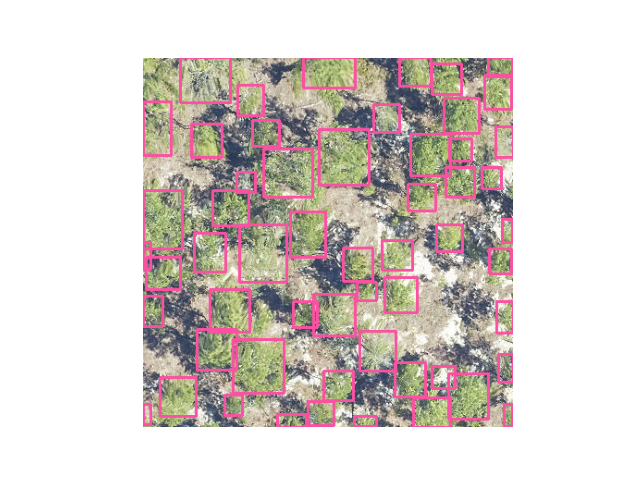
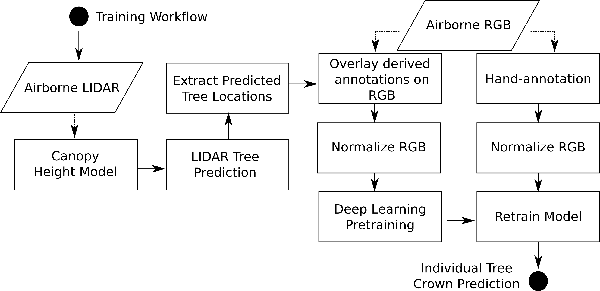

# Getting started

The following is a guide to illustrate the basic uses of this package. This is meant as a walkthrough with import statements and dependencies used in the beginning used throughout for concise code. Please begin from the top.
Here is a simple example of how to predict a single image.

```
from deepforest import main
from deepforest import get_data
import os
import matplotlib.pyplot as plt
model = main.deepforest()
model.use_release()

img = model.predict_image(path="/Users/benweinstein/Documents/NeonTreeEvaluation/evaluation/RGB/TEAK_049_2019.tif",return_plot=True)

#predict_image returns plot in BlueGreenRed (opencv style), but matplotlib likes RedGreenBlue, switch the channel order.
plt.imshow(img[:,:,::-1])
```



## Prebuilt models

DeepForest has a prebuilt model trained on data from 24 sites from the [National Ecological Observatory Network](https://www.neonscience.org/field-sites/field-sites-map). The prebuilt model uses a semi-supervised approach in which millions of moderate quality annotations are generated using a LiDAR unsupervised tree detection algorithm, followed by hand-annotations of RGB imagery from select sites.


For more details on the modeling approach see [citations](landing.html#citation).

Setting the correct window size to match the prebuilt model takes a few tries. The model was trained on 0.1m data with 400px crops. For data of the same resolution, that window size is appropriate. For coarser data, we have experimentally found that larger windows are actually more useful in providing the model context (e.g 1500px windows). At some point windows become too large and the trees are too tiny to classify. Striking a balance is important.

## Sample data

DeepForest comes with a small set of sample data to help run the docs examples. Since users may install in a variety of manners, and it is impossible to know the relative location of the files, the helper function ```get_data``` is used. This function looks to where DeepForest is installed, and finds the deepforest/data/ directory.

```python
sample_image = get_data("OSBS_029.png")
sample_image
'/Users/benweinstein/Documents/DeepForest/deepforest/data/OSBS_029.png'
```

## Prediction

DeepForest allows convenient prediction of new data based on the prebuilt model or a [custom trained](getting_started.html#Training) model. 
There are three ways to format data for prediction.

### Predict a single image


** please note that this video was made before the deepforest-pytorch -> deepforest name change. **

<div style="position: relative; padding-bottom: 62.5%; height: 0;"><iframe src="https://www.loom.com/embed/f80ed6e3c7bd48d4a20ae32167af3d8c" frameborder="0" webkitallowfullscreen mozallowfullscreen allowfullscreen style="position: absolute; top: 0; left: 0; width: 100%; height: 100%;"></iframe></div>


For single images, ```predict_image``` can read an image from memory or file and return predicted tree bounding boxes.
For non-tutorial images, you do not need the get_data function, just provide the full path to the data anywhere on your computer.

```python
image_path = get_data("OSBS_029.png")
boxes = model.predict_image(path=image_path, return_plot = False)
```

```
boxes.head()
         xmin        ymin        xmax        ymax  label    scores
0  334.708405  342.333954  375.941376  392.187531      0  0.736650
1  295.990601  371.456604  331.521240  400.000000      0  0.714327
2  216.828201  207.996216  245.123276  240.167023      0  0.691064
3  276.206848  330.758636  303.309631  363.038422      0  0.690987
4  328.604736   45.947182  361.095276   80.635254      0  0.638212
```

For the release model, there is only one category "Tree", which is numeric 0 label.

### Predict a tile

Large tiles covering wide geographic extents cannot fit into memory during prediction and would yield poor results due to the density of bounding boxes. Often provided as geospatial .tif files, remote sensing data is best suited for the ```predict_tile``` function, which splits the tile into overlapping windows, performs prediction on each of the windows, and then reassembles the resulting annotations.

Let's show an example with a small image. For larger images, patch_size should be increased.

```python
raster_path = get_data("OSBS_029.tif")
# Window size of 300px with an overlap of 25% among windows for this small tile.
predicted_raster = model.predict_tile(raster_path, return_plot = True, patch_size=300,patch_overlap=0.25)
```

** Please note the predict tile function is sensitive to patch_size, especially when using the prebuilt model on new data**

We encourage users to try out a variety of patch sizes. For 0.1m data, 400-800px per window is appropriate, but it will depend on the density of tree plots. For coarser resolution tiles, >800px patch sizes have been effective, but we welcome feedback from users using a variety of spatial resolutions.

### Predict a set of annotations

During evaluation of ground truth data, it is useful to have a way to predict a set of images and combine them into a single data frame. The ```predict_generator``` method allows a user to point towards a file of annotations and returns the predictions for all images.

Consider a headerless annotations.csv file in the following format

```
image_path, xmin, ymin, xmax, ymax, label
```
with each bounding box on a separate row. The image path is relative to the root dir. Its often easiest to just save the .csv file alongside the images.

We can view predictions by supplying a save dir ("." = current directory). Predictions in green, annotations in black.

```python
csv_file = get_data("testfile_deepforest.csv")
boxes = model.predict_file(csv_file=csv_file, root_dir = os.path.dirname(csv_file),savedir=".")
```

### Projecting predictions

DeepForest operates on image data without any concept of geopgraphic projection. 
Annotations and predictions are made in reference to the image coordinate system (0,0). It is often useful to transform this to geographic coordinates. [Rasterio](https://rasterio.readthedocs.io/en/latest/quickstart.html#dataset-georeferencing) provides us with helpful utilities to do this based on a projected image.

For example, consider some sample data that comes with package. We can read in the image, get the transform and coordinate reference system (crs).

```
    img = get_data("OSBS_029.tif")
    r = rasterio.open(img)
    transform = r.transform 
    crs = r.crs
    print(crs)
```

```
    CRS.from_epsg(32617)
```

We can predict tree crowns in the image and then convert them back into projected space

```
    m = main.deepforest()
    m.use_release(check_release=False)
    df = m.predict_image(path=img)
    gdf = utilities.annotations_to_shapefile(df, transform=transform, crs=crs)
```

```
    gdf.total_bounds
    array([ 404211.95, 3285102.85,  404251.95, 3285142.85])
    gdf.crs
    <Projected CRS: EPSG:32617>
    Name: WGS 84 / UTM zone 17N
    Axis Info [cartesian]:
    - [east]: Easting (metre)
    - [north]: Northing (metre)
    Area of Use:
    - undefined
    Coordinate Operation:
    - name: UTM zone 17N
    - method: Transverse Mercator
    Datum: World Geodetic System 1984
    - Ellipsoid: WGS 84
    - Prime Meridian: Greenwich
```
### Customizing box appearance for predictions

The color and line thickness of boxes can be customized using the `color` and `thickness` arguments.
`color` is the color of the bounding box as a tuple of BGR color, e.g. orange annotations is (0, 165, 255).
`thickness` is the thickness of the rectangle border line in pixels.

```python
image_path = get_data("OSBS_029.png")
boxes = model.predict_image(path=image_path, return_plot = True, color=(0, 165, 255), thickness=3)
```

## Training

The prebuilt models will always be improved by adding data from the target area. In our work, we have found that even one hour's worth of carefully chosen hand-annotation can yield enormous improvements in accuracy and precision.
We envision that for the majority of scientific applications at least some fine-tuning of the prebuilt model will be worthwhile. When starting from the prebuilt model for training, we have found that 5-10 epochs is sufficient. 
We have never seen a retraining task that improved after 10-30 epochs, but it is possible if there are very large datasets with very diverse classes.

Consider an annotations.csv file in the following format

testfile_deepforest.csv

```
image_path, xmin, ymin, xmax, ymax, label
OSBS_029.jpg,256,99,288,140,Tree
OSBS_029.jpg,166,253,225,304,Tree
OSBS_029.jpg,365,2,400,27,Tree
OSBS_029.jpg,312,13,349,47,Tree
OSBS_029.jpg,365,21,400,70,Tree
OSBS_029.jpg,278,1,312,37,Tree
OSBS_029.jpg,364,204,400,246,Tree
OSBS_029.jpg,90,117,121,145,Tree
OSBS_029.jpg,115,109,150,152,Tree
OSBS_029.jpg,161,155,199,191,Tree
```

We tell the config that we want to train on this csv file, and that the images are in the same directory. If images are in a separate folder, change the root_dir.

```python
# Example run with short training
annotations_file = get_data("testfile_deepforest.csv")

model.config["epochs"] = 1
model.config["save-snapshot"] = False
model.config["train"]["csv_file"] = annotations_file
model.config["train"]["root_dir"] = os.path.dirname(annotations_file)

model.create_trainer()
```

For debugging, its often useful to use the [fast_dev_run = True from pytorch lightning](https://pytorch-lightning.readthedocs.io/en/latest/common/trainer.html#fast-dev-run)

```
model.config["train"]["fast_dev_run"] = True
```

See [config](https://deepforest.readthedocs.io/en/latest/ConfigurationFile.html) for full set of available arguments. You can also pass any [additional](https://pytorch-lightning.readthedocs.io/en/latest/common/trainer.html) pytorch lightning argument to trainer.

To begin training, we create a pytorch-lightning trainer and call trainer.fit on the model object directly on itself. 
While this might look a touch awkward, it is useful for exposing the pytorch lightning functionality.

```
model.trainer.fit(model)
```

[For more, see Google colab demo on model training](https://colab.research.google.com/drive/1gKUiocwfCvcvVfiKzAaf6voiUVL2KK_r?usp=sharing)


### Video walkthrough of colab

<div style="position: relative; padding-bottom: 56.25%; height: 0;"><iframe src="https://www.loom.com/embed/99c55129d5a34f3dbf7053dde9c7d97e" frameborder="0" webkitallowfullscreen mozallowfullscreen allowfullscreen style="position: absolute; top: 0; left: 0; width: 100%; height: 100%;"></iframe></div>

## Reducing tile size

High resolution tiles may exceed GPU or CPU memory during training, especially in dense forests. To reduce the size of each tile, use preprocess.split_raster to divide the original tile into smaller pieces and create a corresponing annotations file.

For example, this sample data raster has size 2472, 2299 pixels. 
```
"""Split raster into crops with overlaps to maintain all annotations"""
raster = get_data("2019_YELL_2_528000_4978000_image_crop2.png")
import rasterio
src = rasterio.open(raster)
/Users/benweinstein/.conda/envs/DeepForest/lib/python3.9/site-packages/rasterio/__init__.py:220: NotGeoreferencedWarning: Dataset has no geotransform, gcps, or rpcs. The identity matrix be returned.
  s = DatasetReader(path, driver=driver, sharing=sharing, **kwargs)
src.read().shape
(3, 2472, 2299)
```

With 574 trees annotations

```
annotations = utilities.xml_to_annotations(get_data("2019_YELL_2_528000_4978000_image_crop2.xml"))
annotations.shape
(574, 6)
```

```
#Write csv to file and crop
tmpdir = tempfile.gettempdir()
annotations.to_csv("{}/example.csv".format(tmpdir), index=False)
annotations_file = preprocess.split_raster(path_to_raster=raster,
                                           annotations_file="{}/example.csv".format(tmpdir),
                                           base_dir=tmpdir,
                                           patch_size=500,
                                           patch_overlap=0.25)

# Returns a 6 column pandas array
assert annotations_file.shape[1] == 6
```

Now we have crops and annotations in 500 px patches for training.

### Negative samples

To include images with no annotations from the target classes create a dummy row specifying the image_path, but set all bounding boxes to 0

```
image_path, xmin, ymin, xmax, ymax, label
myimage.png, 0,0,0,0,"Tree"
```

Excessive use of negative samples may have negative impact on model performance, but used sparingly it can increase precision. These samples are removed from evaluation and do not count in precision/recall. 

### Model checkpoints

Pytorch lightning allows you to [save a model](https://pytorch-lightning.readthedocs.io/en/stable/common/trainer.html#checkpoint-callback) at the end of each epoch. By default this behevaior is turned off. To restore model checkpointing

```
callback = ModelCheckpoint(dirpath='temp/dir',
                                 monitor='box_recall', 
                                 mode="max",
                                 save_top_k=3,
                                 filename="box_recall-{epoch:02d}-{box_recall:.2f}")
model.create_trainer(logger=TensorBoardLogger(save_dir='logdir/'), 
                                  callbacks=[callback])
model.trainer.fit(model)
```

## Evaluation

Independent analysis of whether a model can generalize from training data to new areas is critical for creating a robust workflow. 
We stress that evaluation data must be different from training data, as neural networks have millions of parameters and can easily memorize thousands of samples. Therefore, while it would be rather easy to tune the model to get extremely high scores on the training data, it would fail when exposed to new images.

To get an evaluation score, specify an annotations file in the same format as the training example above. The model will 
```
csv_file = get_data("OSBS_029.csv")
root_dir = os.path.dirname(csv_file)
results = model.evaluate(csv_file, root_dir, iou_threshold = 0.4)
```

The results object is a dictionary with keys, 'results',"recall","precision". Results is the intersection-over-union scores for each ground truth object in the csv_file.

```
results["results"].head()
    prediction_id  truth_id      IoU    image_path  match
39             39         0  0.00000  OSBS_029.tif  False
19             19         1  0.50524  OSBS_029.tif   True
44             44         2  0.42246  OSBS_029.tif   True
67             67         3  0.41404  OSBS_029.tif   True
28             28         4  0.37461  OSBS_029.tif  False
```

This dataframe contains a numeric id for each predicted crown in each image, the matched ground truth crown in each image. The intersection-over-union score between predicted and ground truth (IoU), and whether that score is greater than the IoU threshold ('match').

The recall is the proportion of ground truth which have a true positive match with a prediction based on the intersection-over-union threshold, this threshold is default 0.4 and can be changed in model.evaluate(iou_threshold=<>)

```
results["box_recall"]
0.705
```

The regression box precision is the proportion of predicted boxes which overlap a ground truth box.

```
results["box_precision"]
0.781
```

### Negative Samples
Negative samples used for training are not included in evaluation scores.

### Saving and loading models

```
import tempfile
import pandas as pd
tmpdir = tempfile.TemporaryDirectory()

model.use_release()

#save the prediction dataframe after training and compare with prediction after reload checkpoint 
img_path = get_data("OSBS_029.png")
model.create_trainer()
model.trainer.fit(model)
pred_after_train = model.predict_image(path = img_path)

#Create a trainer to make a checkpoint
model.trainer.save_checkpoint("{}/checkpoint.pl".format(tmpdir))

#reload the checkpoint to model object
after = main.deepforest.load_from_checkpoint("{}/checkpoint.pl".format(tmpdir))
pred_after_reload = after.predict_image(path = img_path)

assert not pred_after_train.empty
assert not pred_after_reload.empty
pd.testing.assert_frame_equal(pred_after_train,pred_after_reload)
```

---

Note that when reloading models, you should carefully inspect the model parameters, such as the score_thresh and nms_thresh. These parameters are updated during model creation and the config file is not read when loading from checkpoint!
It is best to be direct to specify after loading checkpoint. If you want to save hyperparameters, edit the deepforest_config.yml directly. This will allow the hyperparameters to be reloaded on deepforest.save_model().

---

```
after.model.score_thresh = 0.3
```

Some users have reported a pytorch lightning module error on save

In this case, just saving the torch model is an easy fix.

```
torch.save(model.model.state_dict(),model_path)
```

and restore

```
model = main.deepforest()
model.model.load_state_dict(torch.load(model_path))
```

Note that if you trained on GPU and restore on cpu, you will need the map_location argument in torch.load.


## Multi-class models

While the primary design of this package is for "Tree" detection with a single class. Multi-class labels are allowed for those looking to extend core functionality.
When creating a deepforest model object, pass the designed number of classes and a label dictionary that maps each numeric class to a character label. See FAQ for known challenges of multi-class models on reloading.

```
m = main.deepforest(num_classes=2,label_dict={"Alive":0,"Dead":1})
```

It is often, but not always, useful to start from the general tree detector when trying to identify multiple species. This helps the model focus on learning the multiple classes and not wasting data and time re-learning tree bounding boxes.
To load the backboard and box prediction portions of the release model, but create a classification model for more than one species.

```
m = main.deepforest(num_classes=2, label_dict={"Alive":0,"Dead":0})
deepforest_release_model = main.deepforest()
deepforest_release_model.use_release()
m.model.backbone.load_state_dict(deepforest_release_model.model.backbone.state_dict())
m.model.head.regression_head.load_state_dict(deepforest_release_model.model.head.regression_head.state_dict())

m.config["train"]["csv_file"] = get_data("testfile_multi.csv") 
m.config["train"]["root_dir"] = os.path.dirname(get_data("testfile_multi.csv"))
m.config["train"]["fast_dev_run"] = True
m.config["batch_size"] = 2
    
m.config["validation"]["csv_file"] = get_data("testfile_multi.csv") 
m.config["validation"]["root_dir"] = os.path.dirname(get_data("testfile_multi.csv"))
m.config["validation"]["val_accuracy_interval"] = 1

m.create_trainer()
m.trainer.fit(m)
assert m.num_classes == 2
```

## Issues

We welcome feedback on both the python package as well as the algorithm performance. Please submit detailed issues to the github repo.

[https://github.com/weecology/DeepForest/issues](https://github.com/weecology/DeepForest/issues)
