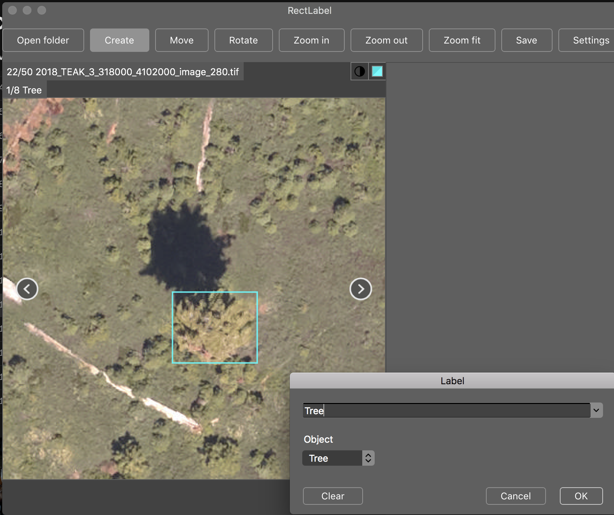
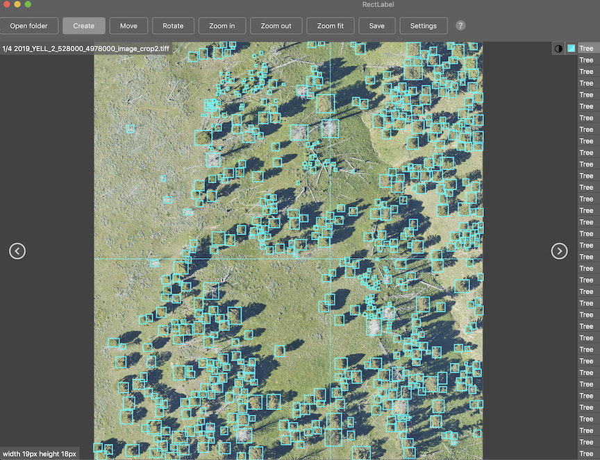
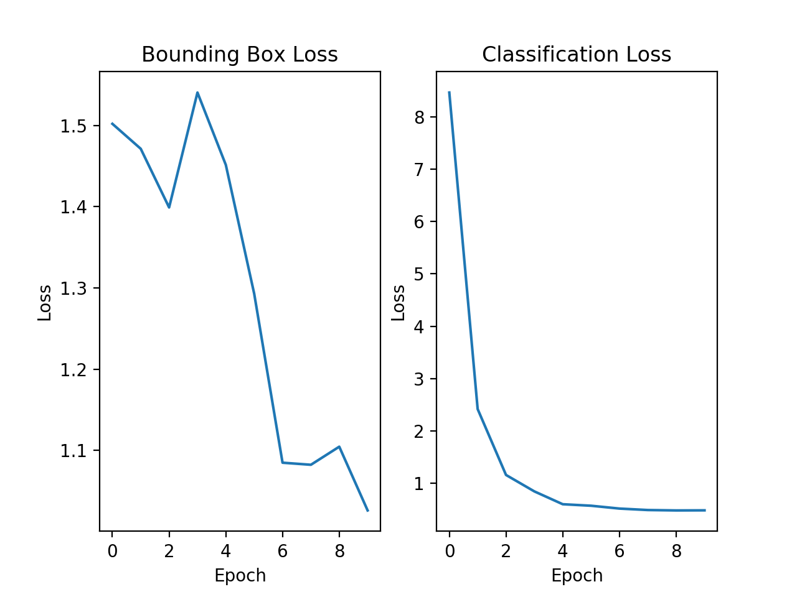

# Training models

Our work has shown that starting training from the prebuilt model increases performance, regardless of the geographic location of your data. In the majority of cases, it will be useful for the model to have learned general tree representations that can be refined using hand annotated data.

Here is a video walkthrough of this page

<div style="position: relative; padding-bottom: 56.25%; height: 0;"><iframe src="https://www.loom.com/embed/21d33b2052a34e0fbdcd0f0578a67b2e" frameborder="0" webkitallowfullscreen mozallowfullscreen allowfullscreen style="position: absolute; top: 0; left: 0; width: 100%; height: 100%;"></iframe></div>

## Design evaluation data

In our experience, defining a clear evaluation dataset and setting a threshold for desired performance is critical before training. It is common to just dive into training new data with only a vague sense of the desired outcome. This is always a mistake. We highly suggest users spend the time to answer 2 questions:

* What kind of data am I trying to predict?

Capturing the variability and the broad range of tree taxonomy and presentation will make development go more smoothly.

* What kind of accuracy do I need to answer my question?

It is natural to want the best model possible, but one can waste a tremendous amount of time trying to eek out another 5% of recall without understanding whether that increase in performance will improve our understanding of a given ecological or natural resource question. Prioritize evaluation data that matches your desired outcomes. Don't obsess over small errors, but rather think about how to propagate and capture this uncertainty in the overall analysis. [All models are wrong, some are useful.](https://en.wikipedia.org/wiki/All_models_are_wrong)

## Gather annotations

DeepForest uses xml files produced by the commonly used annotation program RectLabel. Please note that Rectlabel is an inexpensive program available only for Mac.



For annotations made in RectLabel, DeepForest has a parse function ```preprocess.xml_to_annotations```.

For non-mac users, annotations can be made in any spatial analysis software (e.g QGIS, ArcGIS) and loaded using the shapefile_to_annotations [utility](https://gist.github.com/bw4sz/e2fff9c9df0ae26bd2bfa8953ec4a24c). Please note that due to the installation of GDAL, which can vary widely across systems, this utility is not included in DeepForest source and must be installed seperately.
```
conda install geopandas rasterio rtree
```
will work on most modern systems.

At the end of the day, DeepForest only requires that the final annotations be in the following csv format.

```
image_path, xmin, ymin, xmax, ymax, label
```

Please note that for functions which are fed into keras-retinanet, such as ```evaluate_generator```, ```predict_generator``` and ```train``` this annotation file should be saved without column names. For ```preprocess.split_raster``` the column names should be maintained.

As with the [evaluation example](Example.html), collect training labels from a crop of the training tile and split into smaller windows.



```python
import os
from deepforest import get_data
from deepforest import deepforest
from deepforest import utilities
from deepforest import preprocess

#convert hand annotations from xml into retinanet format
YELL_xml = get_data("2019_YELL_2_528000_4978000_image_crop2.xml")
annotation = utilities.xml_to_annotations(YELL_xml)
annotation.head()

#Write converted dataframe to file. Saved alongside the images
annotation.to_csv("train_example.csv", index=False)

#Find data on path
YELL_train = get_data("2019_YELL_2_528000_4978000_image_crop2.tiff")
crop_dir = os.getcwd()
train_annotations= preprocess.split_raster(path_to_raster=YELL_train,
                                 annotations_file="train_example.csv",
                                 base_dir=crop_dir,
                                 patch_size=400,
                                 patch_overlap=0.05)
#View output
train_annotations.head()

#Write window annotations file without a header row, same location as the "base_dir" above.
annotations_file= os.path.join(crop_dir, "train_example.csv")
train_annotations.to_csv(annotations_file,index=False, header=None)
```

### Config file

Training parameters are saved in a "deepforest_config.yml" file. By default DeepForest will look for this file in the current working directory. If none is found, a default file will be used.

```
###
# Config file for DeepForest module
# The following arguments
###

### Training
### Batch size. If multi-gpu is > 1, this is the total number of images per batch across all GPUs. Must be evenly divisible by multi-gpu.
batch_size: 1
### Model weights to load before training. From keras.model.save_weights()
weights: None
### Retinanet backbone. See the keras-retinanet repo for options. Only resnet50 has been well explored.
backbone: resnet50
### Resize images to min size. Retinanet anchors may need to be remade if signficantly reducing image size.
image-min-side: 800
##Number of GPUs to train
multi-gpu: 1
#Number of full cycles of the input data to train
epochs: 1
#Validation annotations. If training using fit_generator, these will be evaluated as a callback at the end of each epoch.
validation_annotations: None
###Freeze layers. Used for model finetuning, freeze the bottom n layers.
freeze_layers: 0
###Freeze resnet backbone entirely.
freeze_resnet: False

###Evaluation
###Score threshold, above which bounding boxes are included in evaluation predictions
score_threshold: 0.05

#Keras fit_generator methods, these do not apply to tfrecords input_type
multiprocessing: False
workers: 1
max_queue_size: 10
random_transform: False

#save snapshot and images
###Whether to save snapshots at the end of each epoch
save-snapshot: False
#Save directory for images and snapshots
save_path: snapshots/
snapshot_path: snapshots/
```

Using these settings, train a new model starting from the release model. We use are very small number of epochs since this is a sample toy dataset.

```python
#Load the latest release
test_model = deepforest.deepforest()
test_model.use_release()

# Example run with short training
test_model.config["epochs"] = 1
test_model.config["save-snapshot"] = False
test_model.train(annotations=annotations_file, input_type="fit_generator")
```
* Estimated training time on CPU: ~ 6 min/epoch

* Training time on GPU: 14 sec/epoch

#### Comet visualization

For more visualization of model training, comet_ml is an useful platform for understanding machine learning results. There is a free tier for academic audiences. This is optional, but worth considering if you are going to do significant testing.

```python
from comet_ml import Experiment
comet_experiment = Experiment(api_key=<api_key>,
                                  project_name=<project>, workspace=<"username">)

comet_experiment.log_parameters(deepforest_model.config)

test_model.train(annotations=annotations_file, input_type="fit_generator",comet_experiment=comet_experiment)
```

## Training accuracy

Find the training accuracy of the model. We expect this value to be high (mAP > 0.5), if not, consider training for additional epochs.

```python
mAP = test_model.evaluate_generator(annotations=annotations_file)
print("Mean Average Precision is: {:.3f}".format(mAP))
```

returns

```
There are 1 unique labels: ['Tree']
Disabling snapshot saving
Running network: 100% (12 of 12) |#######################################################################################################################################################################################################| Elapsed Time: 0:00:02 Time:  0:00:02
Parsing annotations: 100% (12 of 12) |###################################################################################################################################################################################################| Elapsed Time: 0:00:00 Time:  0:00:00
431 instances of class Tree with average precision: 0.5076
mAP using the weighted average of precisions among classes: 0.5076
mAP: 0.5076
```

## View the training plots

To understand how the loss changes during training we can plot the regression box loss and the classification loss. The regression loss refers to the ability for the model to capture the extent of the bounding box. The classification loss is whether the target box exists, or in a multi-class context, which label to assign to a box. Learn more about [losses](https://machinelearningmastery.com/how-to-choose-loss-functions-when-training-deep-learning-neural-networks/).
```
test_model.plot_curves()
```



If validation annotations were specific during training

```
test_model.config["validation_annotations"] = <filename>
```

The mean average precision is computed after each epoch. This will also be shown alongside the training curves. Learn more about [mean average precision](https://medium.com/@jonathan_hui/map-mean-average-precision-for-object-detection-45c121a31173)
