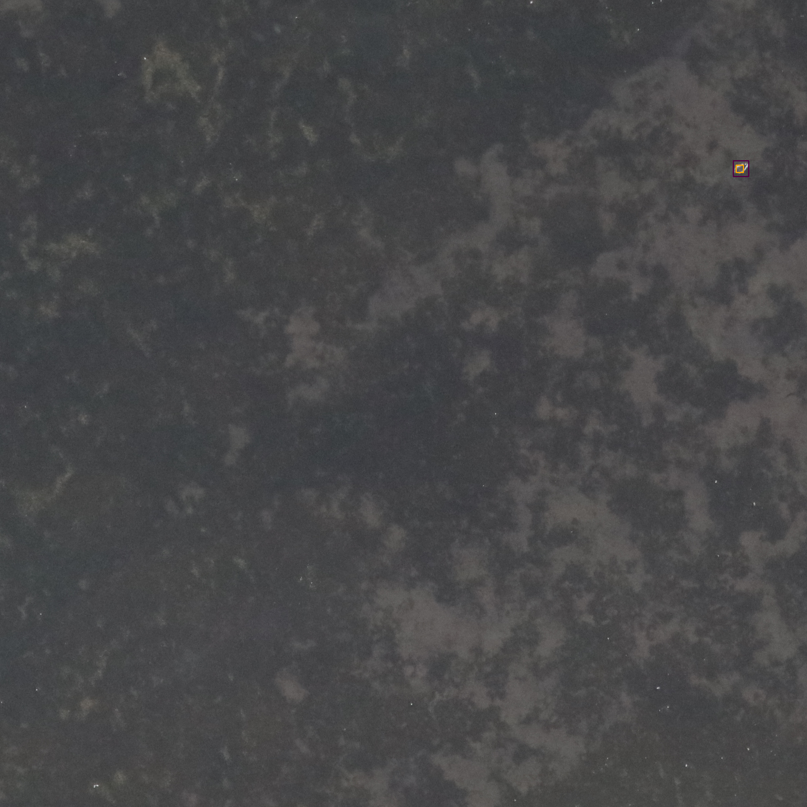
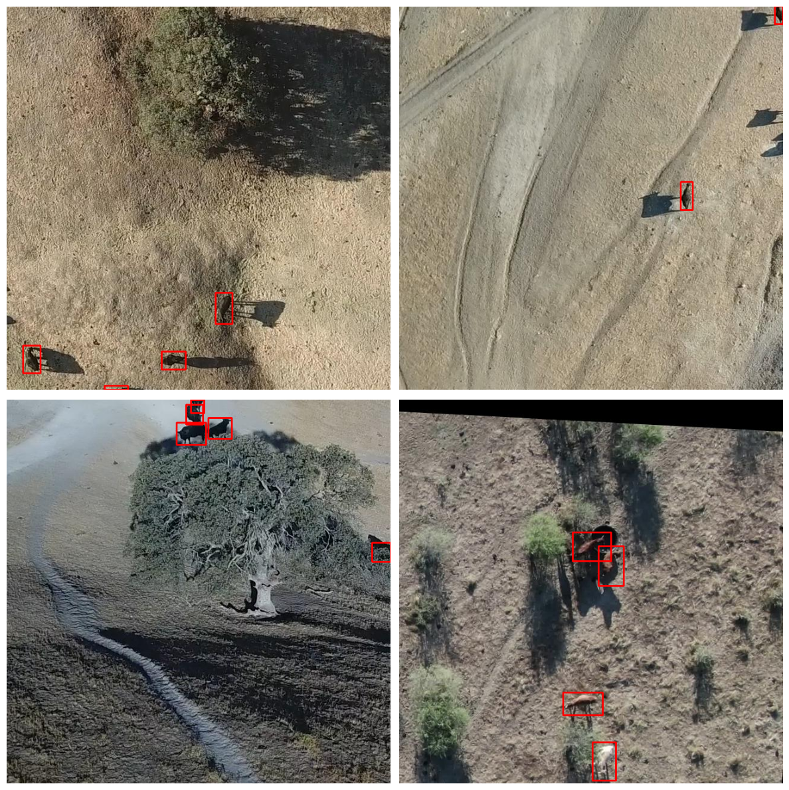
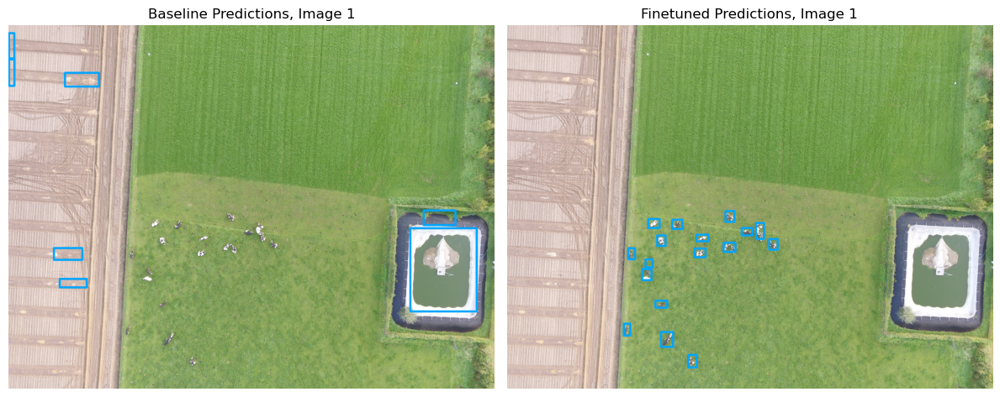

# Prebuilt models

DeepForest comes with prebuilt models to help you get started. These models are available on Hugging Face and are loaded using the `load_model` function, they always are seen as the starting point for further training, rather than a general purpose tool for new imagery.

## Demo

The prebuilt models can be viewed on the hugging face demo. These are for individual images only using the predict_image function. Large files that would typically be run with predict_tile and cut into smaller pieces will not produce accurate results.

https://huggingface.co/spaces/weecology/deepforest-demo

## Tree Crown Detection model

The model was initially described in [Remote Sensing](https://www.mdpi.com/2072-4292/11/11/1309) on a single site. The prebuilt model uses a semi-supervised approach in which millions of moderate quality annotations are generated using a LiDAR unsupervised tree detection algorithm, followed by hand-annotations of RGB imagery from select sites. Comparisons among geographic sites were added to [Ecological Informatics](https://www.sciencedirect.com/science/article/pii/S157495412030011X). The model was further improved, and the Python package was released in [Methods in Ecology and Evolution](https://besjournals.onlinelibrary.wiley.com/doi/full/10.1111/2041-210X.13472).


```python
from deepforest import main

m = main.deepforest()
m.load_model(model_name="weecology/deepforest-tree")
```

The model that is specified in the configuration (see [Configuration](09_configuration_file.md)) will be loaded when you create a `deepforest` object. By default, this is `weecology/deepforest-tree`. However here we've explicitly called `load_model` for demonstration.

### Citation
> Weinstein, B.G.; Marconi, S.; Bohlman, S.; Zare, A.; White, E. Individual Tree-Crown Detection in RGB Imagery Using Semi-Supervised Deep Learning Neural Networks. Remote Sens. 2019, 11, 1309

## Bird Detection model

The model was initially described in [Ecological Applications](https://esajournals.onlinelibrary.wiley.com/doi/abs/10.1002/eap.2694). From the abstract

>
 Using over 250,000 annotations from 13 projects from around the world, we develop a general bird detection model that achieves over 65% recall and 50% precision on novel aerial data without any local training despite differences in species, habitat, and imaging methodology. Fine-tuning this model with only 1000 local annotations increases these values to an average of 84% recall and 69% precision by building on the general features learned from other data sources.
 >

The bird detection model has been updated and retrained from the original `weecology/deepforest-bird` model. The updated model was fine-tuned starting from the tree detection model (`weecology/deepforest-tree`) and trained on data from both Weinstein et al. 2022 as well as new additional bird detection data from multiple sources including https://lila.science/. The result is a dataset with over a million bird detections from around the world. Training details and metrics can be viewed on the [Comet dashboard](https://www.comet.com/bw4sz/bird-detector/6181df1ab7ac40f291b863a2a9b86024?&prevPath=%2Fbw4sz%2Fbird-detector%2Fview%2Fnew%2Fexperiments). 

### Example Predictions

The following examples show predictions from the updated bird detection model:



 ### Citation
> Weinstein, B.G., Garner, L., Saccomanno, V.R., Steinkraus, A., Ortega, A., Brush, K., Yenni, G., McKellar, A.E., Converse, R., Lippitt, C.D., Wegmann, A., Holmes, N.D., Edney, A.J., Hart, T., Jessopp, M.J., Clarke, R.H., Marchowski, D., Senyondo, H., Dotson, R., White, E.P., Frederick, P. and Ernest, S.K.M. (2022), A general deep learning model for bird detection in high resolution airborne imagery. Ecological Applications. Accepted Author Manuscript e2694. https://doi-org.lp.hscl.ufl.edu/10.1002/eap.2694


```python
from deepforest import main

# Load deepforest model and set bird label
m = main.deepforest()
m.load_model(model_name="weecology/deepforest-bird")

# Alternatively, via configuration:
config_args = {
  "model": {"name": "weecology/deepforest-bird"}
}
m = main.deepforest(config_args=config_args)

```


We have created a [GPU colab tutorial](https://colab.research.google.com/drive/1e9_pZM0n_v3MkZpSjVRjm55-LuCE2IYE?usp=sharing
) to demonstrate the workflow for using the bird model.

### Getting Started with DeepForest Bird Detection Model

```{raw} html
<div style="position: relative; padding-bottom: 62.5%; height: 0;">
  <iframe
    src="https://www.loom.com/embed/0039ee541e174180a52cfe9e85228358?sid=d44c25cc-e1bc-46fe-833b-e9c87193e32c"
    frameborder="0"
    webkitallowfullscreen
    mozallowfullscreen
    allowfullscreen
    width="640"
    height="360">
  </iframe>
</div>
```

For more information, or specific questions about the bird detection, please create issues on the [BirdDetector repo](https://github.com/weecology/BirdDetector)

## Livestock Detectors model

This model has a single label 'cattle' trained on drone imagery of cows, sheep and other large mammals in agricultural settings.



The model was improved by @camappel and a nice notebook illustrates its improvement here: https://edsbook.org/notebooks/gallery/95199651-9e81-4cae-a3a7-66398a9a5f62/notebook.



```python
from deepforest import main

# Load deepforest model and set bird label
m = main.deepforest()
m.load_model(model_name="weecology/deepforest-livestock")

# Alternatively, via configuration:
config_args = {
  "model": {"name": "weecology/deepforest-livestock"}
}
m = main.deepforest(config_args=config_args)
```

## Crop Classifiers model

Crop models are classification models (e.g. ResNets) that are applied to cropped predictions as a secondary processing step. Although you could train a single object detection model for fine-grained classification, it is often much easier to take a prebuilt model for tree detection and then train a classifier on a smaller high-quality dataset. For information on how to use crop models, see the Crop Models section.


### Alive/Dead trees model
To provide a simple filter for trees that appear dead in the RGB data we collected 6,342 image crops from the prediction landscape, as well as other NEON sites, and hand annotated them as either alive or dead. We finetuned a resnet-50 pre-trained on ImageNet to classify alive or dead trees before passing them to the species classification model. The model was trained with an ADAM optimizer with a learning rate of 0.001 and batch size of 128 for 40 epochs, and was evaluated on a randomly held out of 10% of the crops. The evaluation accuracy of the alive-dead model was 95.8% (Table S1).

Table S1 Confusion matrix for the Alive/Dead model in Weinstein et al. 2023

|                 | Predicted Alive | Predicted Dead |
|-----------------|-----------------|----------------|
| **Observed Alive**  | 527             | 9              |
| **Observed Dead**   | 10              | 89             |

* Note *, due to the smaller training sizes, the confidence scores are overfit and not smooth. We do not recommend using the confidence scores from this model until it is trained on more diverse data.


Citation: Weinstein, Ben G., et al. "Capturing long‐tailed individual tree diversity using an airborne imaging and a multi‐temporal hierarchical model." Remote Sensing in Ecology and Conservation 9.5 (2023): 656-670.

## Want more pretrained models?

Please consider contributing your data to open source repositories, such as zenodo or lila.science. The more data we gather, the more we can combine the annotation and data collection efforts of hundreds of researchers to built models available to everyone. We welcome suggestions on what models and data are most urgently [needed](https://github.com/weecology/DeepForest/discussions).
