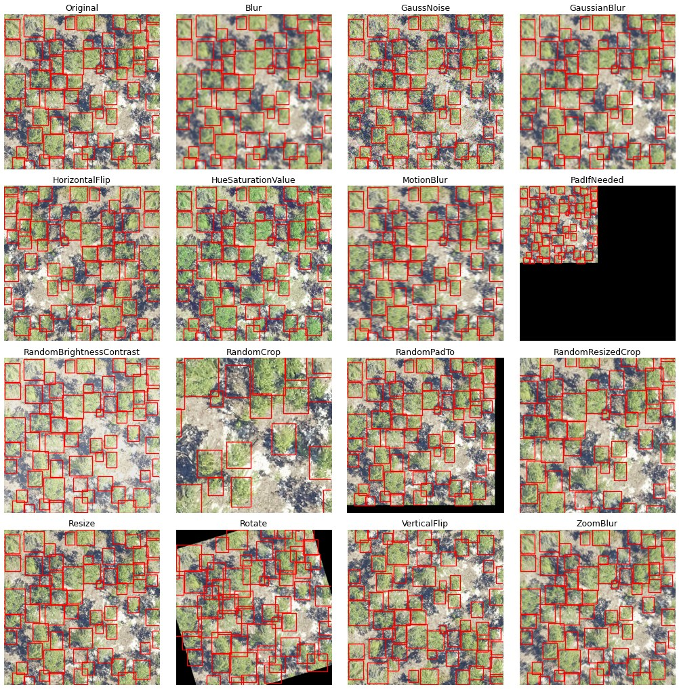

# Training

The prebuilt models will always be improved by adding data from the target area. In our work, we have found that even an hour's worth of carefully chosen hand-annotation can yield enormous improvements in accuracy and precision. 5-10 epochs of fine-tuning with the prebuilt model are often adequate at a low learning rate.

Consider an annotations.csv file in the following format

testfile_deepforest.csv

```
image_path, xmin, ymin, xmax, ymax, label
OSBS_029.jpg,256,99,288,140,Tree
OSBS_029.jpg,166,253,225,304,Tree
OSBS_029.jpg,365,2,400,27,Tree
OSBS_029.jpg,312,13,349,47,Tree
OSBS_029.jpg,365,21,400,70,Tree
OSBS_029.jpg,278,1,312,37,Tree
OSBS_029.jpg,364,204,400,246,Tree
OSBS_029.jpg,90,117,121,145,Tree
OSBS_029.jpg,115,109,150,152,Tree
OSBS_029.jpg,161,155,199,191,Tree
```

The config file specifies the path to the CSV file that we want to use when training. The images are located in the working directory by default, and a user can provide a path to a different image directory.

```python
import os
from deepforest import main
from deepforest import get_data

# Example run with short training
annotations_file = get_data("testfile_deepforest.csv")

# Load the default model
m = main.deepforest()

m.config.train.epochs = 1
m.config.train.csv_file = annotations_file
m.config.train.root_dir = os.path.dirname(annotations_file)

m.create_trainer()
```

For debugging, its often useful to use the [fast_dev_run = True from pytorch lightning](https://pytorch-lightning.readthedocs.io/en/latest/common/trainer.html#fast-dev-run)

```python
m.config.train.fast_dev_run = True
```

See [config](https://deepforest.readthedocs.io/en/latest/ConfigurationFile.html) for full set of available arguments. You can also pass any [additional](https://pytorch-lightning.readthedocs.io/en/latest/common/trainer.html) pytorch lightning argument to trainer.

To begin training, we create a pytorch-lightning trainer and call trainer.fit on the model object directly on itself.
While this might look a touch awkward, it is useful for exposing the pytorch lightning functionality.

```python
m.trainer.fit(model)
```

[For more, see Google colab demo on model training](https://colab.research.google.com/drive/1gKUiocwfCvcvVfiKzAaf6voiUVL2KK_r?usp=sharing)

## Fine-tuning vs from-scratch training

Depending on your task, you might want to fine-tune an existing DeepForest model. This is probably the case if you want to detect trees in a region where the default model performs poorly. If your detection task is very different, like detecting wildlife or non-aerial images then you may wish to train "from scratch". Within DeepForest, this means starting from a generic pretrained model, typically trained on a large dataset like MS-COCO (and usually, on Imagenet as well). This is almost always more efficient than truly training from random weights.

To specify that you don't want to use a prebuilt model, set `model.name = None`. For example:

```python
m = main.deepforest(config_args{"num_classes": 3,
                                "label_dict": {
                                    "Tree": 0,
                                    "Bird": 1,
                                    "Animal": 2
                                }
                                "model":{"name":None}})
```

which will create an initialized RetinaNet model with 3 classes, ready for training. You must always specify your class count and label map.

## Custom datasets with other classes

If you need to re-train a "tree" detection model to work in your specific survey area or ecosystem, you don't need to do anything. Models themselves have no understanding of the label "tree", they output predictions corresponding to numerical class IDs (starting at 0). By default, the `label_dict` in the config is populated when the model is pulled from the hub (or a local checkpoint), which is `{ Tree: 0 }`.

However, if you want to train on multiple classes or detect something that isn't a tree (for example we host a model for multiple Everglades bird species), you need to specify:

1. The number of classes you want to train on (this may be 1, unchanged)
2. The label_dict that specifies what your classes are called.

For example:

```python
config_args = {
    "num_classes": 2,
    "label_dict": {
        "Alive": 0,
        "Dead": 1
    }
}

m = main.deepforest(config_args=config_args)
```

Under the hood, the following steps are taken:

1. DeepForest loads a model from a checkpoint (for fine-tuning), or it initializes a model ready for training.
2. The model initialization code compares the label_dict in the config to the model.
3. If the config is empty, or it matches the model checkpoint, the checkpoint label_dict is used.
4. If your label dict differs (e.g. you set `{"Bird": 0}` and specify a `Tree` checkpoint) then the model will be modified to reflect the new class list. At this point your model is technically unmodified, but the assumption is that you will re-train it.
5. If the class count differs, then the model is modified with the desired number of classes (and it will not provide good predictions until re-trained).

If you modify the defaulf configuration, we assume that you intend to train on your own data, and we will respect your overrides.

## Disable the progress bar

If you want to disable the progress bar while training change the `create_trainer` call to:

```python
from deepforest import model

 model.create_trainer(enable_progress_bar=False)
```

## Loggers

DeepForest logs the training loss, validation loss and class metrics (for multi-class models) during each epoch. To view the training curves, we *highly* recommend using a pytorch-lightning logger, this is the proper way of handling the many outputs during training. See [pytorch-lightning docs](https://lightning.ai/docs/pytorch/stable/extensions/logging.html) for all available loggers.

```python
from deepforest import main

m = main.deepforest()
logger = <any supported pytorch lightning logger>
m.create_trainer(logger=logger)
```

### Video walkthrough of colab

<div style="position: relative; padding-bottom: 56.25%; height: 0;"><iframe src="https://www.loom.com/embed/99c55129d5a34f3dbf7053dde9c7d97e" frameborder="0" webkitallowfullscreen mozallowfullscreen allowfullscreen style="position: absolute; top: 0; left: 0; width: 100%; height: 100%;"></iframe></div>

## Reducing tile size

High resolution tiles may exceed GPU or CPU memory during training, especially when many target objecrts are present. To reduce the size of each tile, use preprocess.split_raster to divide the original tile into smaller pieces and create a corresponding annotations file.

For example, this sample data raster has size 2472, 2299 pixels.
```
"""Split raster into crops with overlaps to maintain all annotations"""
raster = get_data("2019_YELL_2_528000_4978000_image_crop2.png")
import rasterio
src = rasterio.open(raster)
/Users/benweinstein/.conda/envs/DeepForest/lib/python3.9/site-packages/rasterio/__init__.py:220: NotGeoreferencedWarning: Dataset has no geotransform, gcps, or rpcs. The identity matrix be returned.
  s = DatasetReader(path, driver=driver, sharing=sharing, **kwargs)
src.read().shape
(3, 2472, 2299)
```

With 574 trees annotations

```python
from deepforest import utilities
from deepforest import get_data

annotations = utilities.read_pascal_voc(get_data("2019_YELL_2_528000_4978000_image_crop2.xml"))
annotations.shape
(574, 6)
```

```python
import tempfile
from deepforest import preprocess

#Write csv to file and crop
tmpdir = tempfile.gettempdir()
annotations.to_csv("{}/example.csv".format(tmpdir), index=False)
annotations_file = preprocess.split_raster(path_to_raster=raster,
                                           annotations_file="{}/example.csv".format(tmpdir),
                                           base_dir=tmpdir,
                                           patch_size=500,
                                           patch_overlap=0.25)

# Returns a 6 column pandas array
assert annotations_file.shape[1] == 6
```

Now we have crops and annotations in 500 px patches for training.

### Negative samples

To include images with no annotations from the target classes create a dummy row specifying the image_path, but set all bounding boxes to 0

```python
image_path, xmin, ymin, xmax, ymax, label
myimage.png, 0,0,0,0,"Tree"
```

Excessive use of negative samples may have a negative impact on model performance, but when used sparingly, they can increase precision.

### Model checkpoints

Model checkpoints are the output of training. They represent the learned weights that can be distributed and used by anyone with DeepForest installed to perform prediction or fine-tuning. There are two main types of checkpoint that we work with:

1. Lightning checkpoints: these contain a full snapshot of the training state of the model and can be used to resume or continue training. These are accesseed via the `save_checkpoint` and `load_from_checkpoint` functions on a `main.deepforest` object. You can also pass `config` and `config_args` to `load_from_checkpoint` to modify the training conditions (such as training for more epochs). This is a single `.ckpt` file.
2. Hugging Face Hub checkpoints: these are the preferred way to distribute your model once you're happy, and this is what is set in the config as the model name. These checkpoints contain minimial information required to load a model - the weights and a config file that tells the code how to construct the architecture (such as number of classes or other options). You call `save_pretrained` and `load_pretrained` on the model object (e.g. `main.deepforest.model`). This is a folder with a `.safetensors` weight file, and a JSON config.

Pytorch lightning allows you to [save a model](https://pytorch-lighting.readthedocs.io/en/stable/common/trainer.html#checkpoint-callback) at the end of each epoch. By default this behavior is turned off since it slows down training and quickly fills up storage. To restore model checkpointing:

```python
from pytorch_lightning.callbacks import ModelCheckpoint
from pytorch_lightning.loggers import TensorBoardLogger

callback = ModelCheckpoint(dirpath='temp/dir',
                                 monitor='box_recall',
                                 mode="max",
                                 save_top_k=3,
                                 filename="box_recall-{epoch:02d}-{box_recall:.2f}")
model.create_trainer(logger=TensorBoardLogger(save_dir='logdir/'),
                                  callbacks=[callback])
model.trainer.fit(model)
```
### Saving and loading models

To save a model ready to push to HuggingFace Hub, you can use `save_pretrained` with any of the options documented [here](https://huggingface.co/docs/transformers/v5.0.0rc2/en/main_classes/model#transformers.PreTrainedModel.save_pretrained). This is the preferred way to "export" your models for later use.

```python
m = main.deepforest()
m.load_model("weecology/deepforest-tree")

# ... do some training

# Note this is called on the model instance
m.model.save_pretrained("local_path/to/your/checkpoint", push_to_hub=True, repo_id="your_repo")
```

Then you can reload this model later

```python
m = main.deepforest()
m.load_model("local_path/to/your/checkpoint") # or pass "username/your_repo"

# or

m = main.deepforest(config_args={'model': {'name': "username/your_repo"}})
```

Other settings like the score threshold, etc are taken from the config file or `config_args` as usual.

If you want to load a checkpoint that was saved during training (or if you manually called `save_checkpoint`), then just call `load_from_checkpoint`. Note that `config.model.name` must point to a _HuggingFace format checkpoint_, it cannot point to a Lightning checkpoint.

```python
import tempfile
import pandas as pd
from deepforest import main

tmpdir = tempfile.TemporaryDirectory()

# Create a deepforest model and load the latest release
m = main.deepforest()
m.load_model("weecology/deepforest-tree")

#save the prediction dataframe after training and compare with prediction after reload checkpoint
img_path = get_data("OSBS_029.png")
model.create_trainer()
model.trainer.fit(model)
pred_after_train = model.predict_image(path = img_path)

#Save a checkpoint via the trainer
model.trainer.save_checkpoint("{}/checkpoint.pl".format(tmpdir))

#reload the checkpoint to model object
after = main.deepforest.load_from_checkpoint("{}/checkpoint.pl".format(tmpdir))
pred_after_reload = after.predict_image(path = img_path)

assert not pred_after_train.empty
assert not pred_after_reload.empty
pd.testing.assert_frame_equal(pred_after_train,pred_after_reload)
```

---

Note that when reloading models via `load_from_checkpoint`, you should carefully inspect the model parameters, such as the score_thresh and nms_thresh. These parameters are updated during model creation and the config file is not read when loading from checkpoint!

It is best to be direct to specify after loading checkpoint. If you want to save hyperparameters, edit the deepforest_config.yml directly. This will allow the hyperparameters to be reloaded on deepforest.save_model().

---

```
after.model.score_thresh = 0.3
```

Some users have reported a pytorch lightning module error on save.

In this case, just saving the torch model is an easy fix.

```
torch.save(model.model.state_dict(),model_path)
```

and restore

```
model = main.deepforest()
model.model.load_state_dict(torch.load(model_path))
```

Note that if you trained on GPU and restore on cpu, you will need the map_location argument in torch.load.


### Data Augmentations

DeepForest supports configurable data augmentations using [Kornia](https://kornia.readthedocs.io/en/latest/augmentation.html) to improve model generalization across different sensors and acquisition conditions. Augmentations can be specified through the configuration file or passed directly to the model.

#### Configuration-based Augmentations

The easiest way to specify augmentations is through the config file:

```yaml
train:
  # Simple list of augmentation names
  augmentations: ["HorizontalFlip", "RandomResizedCrop"]

  # Or as a list of custom parameters
  augmentations:
    - HorizontalFlip: {p: 0.5}
    - RandomResizedCrop: {size: [400, 400], scale: [0.5, 1.0], p: 0.3}
    - PadIfNeeded: {size: [512, 512], p: 1.0}
```

Note that augmentations are provided as a list (prepended with a `-` in YAML). If you omit this, the parameter will be interpreted as a dictionary and the config parser may fail. If you provide only the augmentation name, default settings will be used. These have been chosen to reflect sensible parameters for different transformations, as it's quite easy to "over augment" which can make models harder to train. By default, if you enable augmentation and do not specify a transform explicitly, only `HorizontalFlip` will be used.

You can also specify augmentations programmatically:

```python
from deepforest import main

# Using config_args
config_args = {
    "train": {
        "augmentations": ["HorizontalFlip", "RandomBrightnessContrast"]
    }
}
model = main.deepforest(config_args=config_args)

# Or with parameters
config_args = {
    "train": {
        "augmentations": [
            "HorizontalFlip": {"p": 0.8},
        ]
    }
}
model = main.deepforest(config_args=config_args)
```

#### Available Augmentations

DeepForest supports the following augmentations optimized for object detection, which you can specify via a single keyword:

- **[HorizontalFlip](https://kornia.readthedocs.io/en/latest/augmentation.module.html#kornia.augmentation.RandomHorizontalFlip)**: Randomly flip images horizontally
- **[VerticalFlip](https://kornia.readthedocs.io/en/latest/augmentation.module.html#kornia.augmentation.RandomVerticalFlip)**: Randomly flip images vertically
- **[Resize](https://kornia.readthedocs.io/en/latest/augmentation.module.html#kornia.augmentation.LongestMaxSize)**: Resize images while maintaining aspect ratio
- **[RandomCrop](https://kornia.readthedocs.io/en/latest/augmentation.module.html#kornia.augmentation.RandomCrop)**: Extract random crops from images
- **[RandomResizedCrop](https://kornia.readthedocs.io/en/latest/augmentation.module.html#kornia.augmentation.RandomResizedCrop)**: Crop image at random location and resize while preserving bounding boxes
- **[PadIfNeeded](https://kornia.readthedocs.io/en/latest/augmentation.module.html#kornia.augmentation.PadTo)**: Pad images to minimum size
- **RandomPadTo**: add random padding to the image
- **[Rotate](https://kornia.readthedocs.io/en/latest/augmentation.module.html#kornia.augmentation.RandomRotation)**: Rotate images by small angles
- **[RandomBrightnessContrast](https://kornia.readthedocs.io/en/latest/augmentation.module.html#kornia.augmentation.ColorJiggle)**: Adjust brightness and contrast
- **[HueSaturationValue](https://kornia.readthedocs.io/en/latest/augmentation.module.html#kornia.augmentation.ColorJiggle)**: Adjust color properties
- **[GaussNoise](https://kornia.readthedocs.io/en/latest/augmentation.module.html#kornia.augmentation.RandomGaussianNoise)**: Add gaussian noise
- **[Blur](https://kornia.readthedocs.io/en/latest/augmentation.module.html#kornia.augmentation.RandomBoxBlur)**: Apply box blur effect
- **[GaussianBlur](https://kornia.readthedocs.io/en/latest/augmentation.module.html#kornia.augmentation.RandomGaussianBlur)**: Apply gaussian blur effect
- **[MotionBlur](https://kornia.readthedocs.io/en/latest/augmentation.module.html#kornia.augmentation.RandomMotionBlur)**: Apply motion blur effect
- **ZoomBlur**: Apply zoom blur effect (similar to radial motion blur in [GIMP](https://gimp.linux.it/www/manual/2.10/html/en/gimp-filter-motion-blur-zoom.html)).

Other `kornia` transforms are also supported in principle, but the above should cover most use-cases for aerial object detection.



#### Zoom Augmentations for Multi-Resolution Training

For improved generalization across different image resolutions and scales, you can configure transformations that will generate training samples with "zoomed" imagery.

The simplest way to achieve this is to perform a random resize. If the image is purely rescaled with no change in bounds, this is equivalent to an image with a different ground sample distance. A 1024 px image covering 100 m is around 10 cm/px, if rescaled to 512 px, the image is now 20 cm/px. Since this may perform an upscale, we tend to want to crop the augmented image as well (or pad). Kornia provides this in one operation via `RandomResizedCrop` which takes a crop of the image and then resizes to a target, with padding if needed; this is effectively the same thing.

`RandomResizedCrop` can only zoom "in" to an image, that is the `scale` parameter is ineffective above `1.0`. We provide a random version of `PadTo`, `RandomPadTo` which will add a user-defined amount of padding to an image, effectively zooming out before the crop is acquired.

You will likely need to experiment to find the best augmentation strategy for your data. Cropping is an effective way to use large, high-resolution, images - such as from drones - at a wide range of scales. We suggest trying only crops first, before adding padding.

```python
# Configuration for zoom/scale augmentations
config_args = {
    "train": {
        "augmentations": [
            # Optional: occasionally "zoom out"
            "RandomPadTo": {"pad_range": (0, 50), "p": 0.2},

            # Crop at different scales while preserving objects
            "RandomResizedCrop": {"size": (800, 800), "scale": (0.5, 1.0), "p": 0.3},

            # Basic data augmentation
            "HorizontalFlip": {"p": 0.5}
        ]
    }
}

from deepforest import main
model = main.deepforest(config_args=config_args)
```

#### Custom Transformations

For complete control over augmentations, you can still provide custom transforms. You can write your own `kornia` pipeline and provide an `AugmentationSequential` [container](https://kornia.readthedocs.io/en/latest/augmentation.container.html#kornia.augmentation.container.AugmentationSequential). DeepForest will pass samples to your transform pipeline in a specific order, so you should set the following data keys:

```python
import kornia.augmentation as K
from kornia.constants import DataKey
from deepforest import main

data_keys=[DataKey.IMAGE, DataKey.BBOX_XYXY]

# Set up your transform pipeline:
transform = K.AugmentationSequential(K.RandomRGBShift(), data_keys=data_keys)

model = main.deepforest(transforms=transform)
```

You may pass any function which takes an image and target (bboxes in xyxy format) tensors as arguments. It must return an image and target tensor in the same format. DeepForest will handle box filtering, as `kornia` does not provide this functionality, so your transform pipeline should also **not** drop targets that may have been moved outside the image bounds after a geometric transformation.

```python

def transform(image: torch.Tensor, targets: torch.Tensor) -> tuple(torch.Tensor, torch.Tensor):

    return image, targets
```

**How do I make training faster?**

While it is impossible to anticipate the setup for all users, there are a few guidelines. First, a GPU-enabled processor is key. Training on a CPU can be done, but it will take much longer (100x) and is probably only done if needed. Using Google Colab can be beneficial but prone to errors. Once on the GPU, the configuration includes a "workers" argument. This connects to PyTorch's dataloader. As the number of workers increases, data is fed to the GPU in parallel. Increase the worker argument slowly, we have found that the optimal number of workers varies by system.

```
m.config.workers = 5
```

It is not foolproof, and occasionally 0 workers, in which data loading is run on the main thread, is optimal : https://stackoverflow.com/questions/73331758/can-ideal-num-workers-for-a-large-dataset-in-pytorch-be-0.

For large training runs, setting preload_images to True can be helpful.

```
m.configpreload_images = True
```

This will load all data into GPU memory once, at the beginning of the run. This is great, but it requires you to have enough memory space to do so.
Similarly, increasing the batch size can speed up training. Like both of the options above, we have seen examples where performance (and accuracy) improves and decreases depending on batch size. Track experiment results carefully when altering batch size, since it directly [effects the speed of learning](https://www.baeldung.com/cs/learning-rate-batch-size).

```
m.config.batch_size = 10
```

Remember to call m.create_trainer() after updating the config dictionary.

### Avoiding **Weakly referenced objects** errors

On some devices and systems we have found an error referencing the model.trainer object that was created in m.create_trainer().
We welcome a reproducible issue to address this error as it appears highly variable and relates to upstream issues. It appears more common on google colab and github actions.

In most cases, this error appears when running multiple calls to model.predict or model.train. We believe this occurs because garbage collection has deleted the model.trainer object see:
https://github.com/Lightning-AI/lightning/issues/12233
https://github.com/weecology/DeepForest/issues/338

If you run into this error, users (e.g https://github.com/weecology/DeepForest/issues/443), have found that creating the trainer object within the loop can resolve this issue.

```python
for tile in tiles_to_predict:
    m.create_trainer()
    m.predict_tile(tile)
```

Usually creating this object does not cost too much computational time.

#### Training across multiple nodes on a HPC system

We have heard that this error can appear when trying to deep copy the pytorch lightning module. The trainer object is not pickleable.
For example, on multi-gpu environments when trying to scale the deepforest model the entire module is copied leading to this error.
Setting the trainer object to None and directly using the pytorch object is a reasonable workaround.

Replace

```python
m = main.deepforest()
m.create_trainer()
m.trainer.fit(m)
```

with

```python
m.trainer = None
from pytorch_lightning import Trainer

    trainer = Trainer(
        accelerator="gpu",
        strategy="ddp",
        devices=model.config.devices,
        enable_checkpointing=False,
        max_epochs=model.config.train.epochs,
        logger=comet_logger
    )
trainer.fit(m)
```

The added benefits of this is more control over the trainer object.
The downside is that it doesn't align with the .config pattern where a user now has to look into the config to create the trainer.
We are open to changing this to be the default pattern in the future and welcome input from users.

#### Visualization during training

Visualizing images during training can be valuable to spot augmentation that isn't working as you expected, label issues and to see if the model is learning anything. To make this easy, we provide a Lightning callback that can be used with the trainer: `deepforest.callbacks.ImagesCallback`. You need to provide a directory path where the images will be saved, which can be a temporary path if you don't want to keep the images. To use, create the callback object and pass it to `create_trainer` along with any other callbacks you need.

```python
from pathlib import Path
import tempfile
from pytorch_lightning.loggers import CSVLogger
from deepforest import callbacks

logger = CSVLogger(save_dir="./logs")

# You can access the log directory from other loggers you've set up, to keep everything in the same place.
# the log_dir attribute is the resolved path that includes name and version number.


im_callback = callbacks.ImagesCallback(save_dir=Path(logger.log_dir) / "images", every_n_epochs=2)
m.create_trainer(callbacks=[im_callback], logger=logger)
```

The callback will, by default, log images to disk. When training starts, it will save images for the training and validation dataset (if available). Then at a user-specified interval (`every_n_epochs`), predictions will be logged with ground truth. If you have Comet or Tensorboard loggers (loggers which accept `add_image` or `log_image`) then the callback will attempt to log to those. Due to auto-discovery behavior with Comet, the callback will preferentially log to Tensorboard if present, to avoid images being pushed to Comet twice. To adjust the number of samples saved, modify `dataset_samples` and `prediction_samples` (set to 0 to disable).

If you don't want to keep images on disk, for example if you're using a cloud-based logger like Comet, you can pass a temporary directory to the callback.

```python
with tempfile.TemporaryDirectory() as tmpdir:
    im_callback = callbacks.ImagesCallback(save_dir=tmpdir, every_n_epochs=2)
    m.create_trainer(callbacks=[im_callback], logger=logger)
    m.trainer.fit(m)
```

#### Training via command line

We provide a basic script to trigger a training run via CLI. This script is installed as part of the standard DeepForest installation is called `deepforest train`. We use [Hydra](https://hydra.cc/docs/intro/) for configuration management and you can pass configuration parameters as command line arguments as follows:

```{note}
If you are using `uv` to manage your Python environment, remember to prefix these commands with `uv run`, for example: `uv run deepforest predict`.
```

```bash
deepforest train batch_size=8 train.csv_file=your_labels.csv train.root_dir=some/path
```

Under the hood, this sets up a DeepForest model, creates a trainer and runs `fit`. You can have a look at the script in `src/deepforest/scripts/train.py` to see exactly what's being run. However for most users, configuring the dataset paths (`train.csv_file` and `train.root_dir`) and perhaps modifying `batch_size` should be sufficient to start with. By setting up your own configuration or passing arguments via command line, you can train models without ever writing a python script.

The tool includes a number of convenience features that we commonly need: logging, checkpointing, debug predictions and the option to monitor via Tensorboard (local) or Comet ML (cloud). You can resume training by passing the flag `--resume` with the path to a checkpoint created during training. Logs are saved to your `config.log_root`, which you can set to wherever is convenient. Experiments will then be saved in separate subfolders, versioned by timestamp if necessary.

If you want to use Comet, pass `--comet` and the experiment will automatically log to the environment variables `COMET_PROJECT` and `COMET_WORKSPACE` (run `comet login` in your environment first, [further docs here](https://www.comet.com/docs/v2/guides/quickstart/)). With this option enabled, the log folder will be given the same name as the experiment, which can either be set by you (pass `--experiment-name`) or auto-generated by Comet. You can also pass any number of `--tags` which will be added to the Comet experiment. The experiment ID is stored in the metadata for each run; if you resume interrupted training, metrics will be pushed to the existing experiment automatically.

The log directory structure depends on which flags you pass:

| Flags | Log structure |
|---|---|
| *(none)* | `{log_root}/{timestamp}/` |
| `--experiment-name my-run` | `{log_root}/my-run/{timestamp}/` |
| `--comet` | `{log_root}/{comet_auto_name}/` |
| `--comet --experiment-name my-run` | `{log_root}/my-run/{timestamp}/` |

When `--experiment-name` is set, each run gets a unique timestamp subdirectory (e.g. `20260212_153042`), so repeated runs with the same name won't collide. Without `--experiment-name`, Comet's auto-generated name (e.g. `azure-capybara-42`) is used directly.

This is an example of a log directory. The `checkpoints` folder contains both training checkpoints (top-1 and last) and HuggingFace compatible weights which can be pushed to the hub. `images` contains `predictions` (per epoch), `train` and `validation` samples which are created at the beginning of training. `metrics.csv` and `hparams.yaml` are generated by Lightning and contain the configuration state when training was started.

```bash
tree pretrain/late_meadowlark_5698
├── checkpoints
│   ├── hf_weights
│   │   ├── config.json
│   │   ├── model.safetensors
│   │   └── README.md
│   ├── last.ckpt
│   ├── retinanet-epoch:07-map_50:0.16.ckpt
├── hparams.yaml
├── images
│   ├── predictions
│   │   ├── 2018_TEAK_3_323000_4098000_image_691_11742.json
│   │   ├── 2018_TEAK_3_323000_4098000_image_691_11742.png
│   │   ├── 2018_TEAK_3_323000_4098000_image_691_13699.json
│   │   ├── 2018_TEAK_3_323000_4098000_image_691_13699.png
│   │   ├── 2018_TEAK_3_323000_4098000_image_691_23484.json
│   │   ├── 2018_TEAK_3_323000_4098000_image_691_23484.png
        ...
│   ├── train_sample
│   │   ├── 2019_HOPB_3_719000_4705000_image_tile_97.png
│   │   ├── 2019_SERC_4_369000_4304000_image_tile_2.png
│   │   ├── 2019_SOAP_4_301000_4106000_image_tile_61.png
│   │   ├── 2019_WREF_3_577000_5072000_image_tile_15.png
│   │   └── 2019_WREF_3_581000_5079000_image_tile_82.png
│   └── validation_sample
│       ├── BLAN_009_2019.png
│       ├── JERC_048_2018.png
│       ├── MLBS_062_2018.png
│       ├── SJER_009_2018.png
│       └── SOAP_056_2019.png
├── metrics.csv
```

For throwaway experiments, generated names are convenient, but for science results you might want to pick something more easily interpretable like `retinanet-my_dataset-fold-4`. In this case, a timestamp will be added in case you run the experiment multiple times.

To view Tensorboard logs (`--tensorboard`), call `uv run tensorboard --logdir <log_root>`. Tensorboard is a little less polished than Comet, but it's completely free and supports all the basic functionality you need for tracking model training runs. DeepForest's image logger will push images to Tensorboard as well. You can pass _both_ flags and log to both Tensorboard and Comet simultaneously. One reason to do this is to [distribute your training logs on HuggingFace](https://huggingface.co/docs/hub/en/tensorboard#adding-your-tensorboard-traces).

To check what configuration options are available, run:

```bash
deepforest config
```

which will show you where Hydra is looking and what the current (default) config is. You can then pick which parameters you want to override with the syntax `<key>=<value>`. For nested cofiguration, like the `train` option we passed above, separate levels of nesting with periods (`.`), such as `train.scheduler.params.gamma=0.1`.

For more complex training requirements, such as adding additional transforms or other aspects which are not directly modifiable via the config file, we suggest using the script as a reference.

To override settings using your own configuration file, we recommend copying the default configuration and place it in your working/training directory. This is the **preferred method** for repeatable training because it will provide you with a full record of the configuration of your training run. Then run:

```bash
deepforest --config-dir /your/config/folder --config-name config_file_name train
```

Note you don't need to pass the `yaml` extension. This method uses Hydra's [standard flags](https://hydra.cc/docs/advanced/hydra-command-line-flags/). Otherwise you can save a config file using any valid subset of the options (for example just the CSV location and root directory) and Hydra will overlay those on top of the default config. The CLI script will first load the default configuration and then load `/your/config/folder/config_file_name.yaml`.
