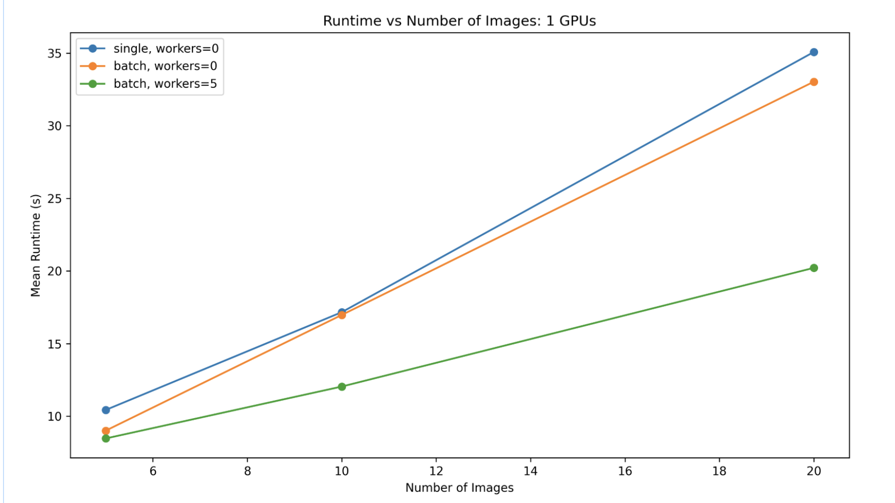

# Prediction

There are atleast four ways to make predictions with DeepForest.

1. Predict an image using [model.predict_image](https://deepforest.readthedocs.io/en/latest/source/deepforest.html#deepforest.main.deepforest.predict_image). The entire image is passed to the model.

2. Predict a large number, which we call a 'tile', using [model.predict_tile](https://deepforest.readthedocs.io/en/latest/source/deepforest.html#deepforest.main.deepforest.predict_tile). The tile is cut into smaller windows and each window is predicted.

3. Predict a directory of images using a csv file using [model.predict_file](https://deepforest.readthedocs.io/en/latest/source/deepforest.html#deepforest.main.deepforest.predict_file). Each unique image listed in a csv file is predicted.

4. Predict a batch of images using [model.predict_batch](https://deepforest.readthedocs.io/en/latest/source/deepforest.html#deepforest.main.deepforest.predict_batch). This is useful when you have an existing dataloader from outside DeepForest that yields data in batches.

In general, during inference, for large images it is most common to use predict_tile.

## Predict an image using the command line

We provide a basic utility script to run a prediction task with the ability to save and/or plot outputs. This command is called `deepforest predict` and is included as part of the standard installation. You can run the command without any arguments, or the `--help` flag to check that it's available. The script will run in tiled prediction mode by default.

```{note}
If you are using `uv` to manage your Python environment, remember to prefix these commands with `uv run`, for example: `uv run deepforest predict`.
```

```bash
> deepforest predict -h

usage: deepforest predict [-h] [-o OUTPUT] [--plot] input

positional arguments:
  input                 Path to input raster

options:
  -h, --help            show this help message and exit
  -o OUTPUT, --output OUTPUT
                        Path to prediction results
  --plot                Plot results

Any remaining arguments <key>=<value> will be passed to Hydra to override the current config.
```

You should provide an `input` path, to an image you'd like predictions for. If you want to save the results as a CSV file, use `-o`. If you want to plot the results in a GUI, you can use the `--plot` flag. Any and all other configuration options can be provided afterwards, for example if you wanted to change the patch size:

```bash
deepforest predict ./path/to/your/image.tif -o results.csv patch_size=250 patch_overlap=0.1
```

We use [Hydra](https://hydra.cc/docs/intro/) for configuration management, and the format for specifying predictions is a space-separated list of `<key>=<value>`s, like the example above.

To see the default configuration and to check what options you can set, you can run `deepforest --show-config` flag (no other options are required).

## Predict an image using model.predict_image

This is most commonly used for small images or pre-cropped windows of large tiles. Passing a large tile to predict_image will lead to poor performance, use predict_tile.

```python
from deepforest import get_data
from deepforest import main
from deepforest.visualize import plot_results

# Initialize the model class
model = main.deepforest()

# Load a pretrained tree detection model from Hugging Face
model.load_model(model_name="weecology/deepforest-tree", revision="main")

sample_image_path = get_data("OSBS_029.png")
img = model.predict_image(path=sample_image_path)
plot_results(img)
```

# Predicting Large Images with `model.predict_tile`

`predict_tile` is designed for **large images that cannot fit into memory** during prediction. It splits the image into overlapping tiles, predicts each tile individually, and merges the results. This ensures accurate predictions while keeping memory usage low, making it ideal for high-resolution geospatial data such as `.tif` remote sensing images.

## Key Parameters

- **`path`**: Path to your input raster image.
- **`patch_size`**: Size (in pixels) of each tile/window. Larger tiles cover more area but use more memory. Typical values: **300–800 px per tile**.
- **`patch_overlap`**: Fractional overlap between adjacent tiles (default `0.25`). Helps avoid missing objects at tile borders.
- **`dataloader_strategy`**: Controls how tiles are loaded into memory:
  - `"single"`: Loads tiles one at a time on CPU and sends them individually to GPU. Memory-efficient.
  - `"batch"`: Processes multiple tiles in batches on GPU. More efficient if GPU memory allows, but tiles are still used rather than loading the full image.
  - `"window"`: Reads only the requested tile from the raster dataset. **Most memory-efficient**, but cannot parallelize across windows.

> **Tip:** Always test your workflow on a smaller image first to avoid memory issues.

## Example Usage

```python
from deepforest import main, get_data
from deepforest.visualize import plot_predictions

# Initialize the DeepForest model
model = main.deepforest()

# Load pretrained tree detection model explicitly
model.load_model(
    model_name="weecology/deepforest-tree",
    revision="main"
)

# Load example raster image
path = get_data("OSBS_029.tif")

# Predict using tiled strategy
predicted_raster = model.predict_tile(
    path,
    patch_size=300,
    patch_overlap=0.25,
    dataloader_strategy="window"
)

# Visualize predicted bounding boxes (if using in-memory predictions)
# Note: plot_predictions expects a list of bounding boxes, not a raster file
# predictions = model.predict_image(path)  # Optional: for small image testing
# plot_predictions(predictions)

# To save the merged raster predictions:
# predicted_raster.save("predicted_output.tif")
```

### dataloader-strategy

An optional argument to predict_tile allows the user to control how to scale prediction of tiles and how the windows are created within tiles.

```python
prediction_single = m.predict_tile(path=path, patch_size=300, dataloader_strategy="single")
```

The `dataloader_strategy` parameter has three options:

- **single**: Loads the entire image into CPU memory and passes individual windows to GPU.

- **batch**: Loads the entire image into GPU memory and creates views of the image as batches. Requires the entire tile to fit into GPU memory. CPU parallelization is possible for loading images.

- **window**: Loads only the desired window of the image from the raster dataset. Most memory efficient option, but cannot parallelize across windows due to Python's Global Interpreter Lock, workers must be set to 0.



The image shows that the speed of the predict_tile function is related to the strategy, the number of images, and the number of dataloader workers, which is set in the deepforest config file.

### Patch Size

The _predict_tile_ function is sensitive to _patch_size_, especially when using the prebuilt model on new data.
We encourage users to experiment with various patch sizes. For 0.1m data, 400-800px per window is appropriate, but it will depend on the density of tree plots. For coarser resolution tiles, >800px patch sizes have been effective.

## Predict a directory of using a csv file using model.predict_file

For a list of images with annotations in a csv file, the `predict_file` function will return a dataframe with the predicted bounding boxes for each image as a single dataframe. This is useful for making predictions on a large number of images that have ground truth annotations.

```python

csv_file = get_data("OSBS_029.csv")
original_file = pd.read_csv(csv_file)
df = m.predict_file(csv_file, root_dir=os.path.dirname(csv_file))
```

```
>>> print(df.head())
         xmin        ymin        xmax        ymax  label     score    image_path                                           geometry
0  330.080566  342.662140  373.715454  391.686005      0  0.802979  OSBS_029.tif  POLYGON ((373.715 342.662, 373.715 391.686, 33...
1  216.171234  206.591583  248.594879  242.545593      0  0.778803  OSBS_029.tif  POLYGON ((248.595 206.592, 248.595 242.546, 21...
2  325.359222   44.049034  363.431244   82.248329      0  0.751573  OSBS_029.tif  POLYGON ((363.431 44.049, 363.431 82.248, 325....
3  261.008606  238.633163  296.410034  276.705475      0  0.748605  OSBS_029.tif  POLYGON ((296.410 238.633, 296.410 276.705, 26...
4  173.029999    0.000000  229.023438   33.749977      0  0.738210  OSBS_029.tif  POLYGON ((229.023 0.000, 229.023 33.750, 173.0...
```

## Predict a batch of images using model.predict_batch

For existing dataloaders, the `predict_batch` function will return a list of dataframes, one for each batch. This is more efficient than using predict_image since multiple images can be processed in a single forward pass.

```python
from deepforest.datasets.training import BoxDataset
from torch.utils.data import DataLoader
import numpy as np
from PIL import Image

path = get_data("OSBS_029.tif")
tile = np.array(Image.open(path))
ds = BoxDataset(tile=tile, patch_overlap=0.1, patch_size=100)
dl = DataLoader(ds, batch_size=3)

# Perform prediction
predictions = []
for batch in dl:
    prediction = m.predict_batch(batch)
    predictions.append(prediction)
```
