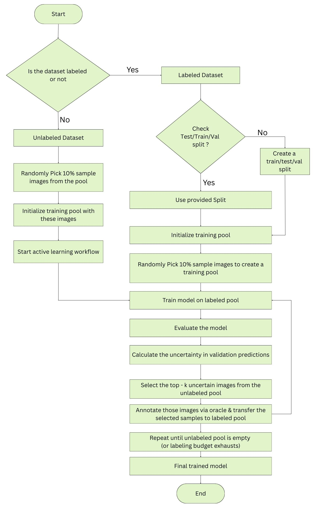

# Active Learning submodule

Active learning in the context of image object detection is a technique for efficiently selecting the most valuable images and objects to annotate, reducing the labeling effort required for model training while maximizing performance gains. This submodule provides active learning utilities. It wraps DeepForest’s training and inference APIs with a small, reproducible loop that selects informative unlabeled images using an entropy-based acquisition function. It is designed to be extensible, so you can swap selection strategies, wire it to an annotation tool (Label Studio), and run multi-round training.

# Key Features

- Reproducible training rounds via explicit seeding
- YAML- or dict-based configuration with validation (no `Config` dataclass)
- PyTorch Lightning training with checkpointing and early stopping
- Batch prediction over image lists
- Entropy-based acquisition that scores each image by uncertainty
- DeepForest-compatible CSV and image-path I/O
- Label Studio integration `src/deepforest/label_studio.py`. Pre-annotation upload is optional and not included by default

# Basic flow of the submodule



# Quickstart

```python
# Recommended: configure via YAML and construct the learner with learner_from_yaml()
# Your YAML must include all required keys used by load_config()
from active_learning import learner_from_yaml

learner = learner_from_yaml("active_learning.yml")

# Train one round and evaluate
ckpt_path = learner.fit_one_round()
metrics = learner.evaluate()
print("Best checkpoint:", ckpt_path)
print("Eval metrics:", {k: v for k, v in metrics.items() if not hasattr(v, "head")})

# Select uncertain images from a file of paths (one path per line) or a list
manifest = learner.select_for_labeling("/data/trees/unlabeled_paths.txt", k=50)
print(manifest.head())
```

If you prefer not to use YAML, you can pass a validated dict directly to `ActiveLearner(cfg_dict)`. The dict must include the same keys that `load_config()` enforces (`workdir`, `images_dir`, `train_csv`, `val_csv`, `classes`, `training/eval/acquisition hyperparams`, etc.).

`select_for_labeling()` accepts either a Python list of image paths or a text file with one path per line and ranks images by Shannon entropy of predicted class score mass. And the label Studio usage (exporting tasks and converting to DeepForest CSV) is handled by separate helper functions; they’re not part of ActiveLearner itself.

## How It Works

- **Training:** `ActiveLearner.fit_one_round()` uses the PyTorch Lightning `Trainer` that’s created in `__init__` (with checkpointing and early stopping) to train the DeepForest model for `cfg["epochs_per_round"]`.

- **Evaluation:** `ActiveLearner.evaluate()` runs DeepForest’s evaluation on `cfg["val_csv"]` with the IoU threshold `cfg["iou_eval"]`, returning a metrics dict.

- **Prediction:** `ActiveLearner.predict_images(paths)` calls `model.predict_image` on each path using `cfg["score_threshold_pred"]` and returns a dict `{image_path: DataFrame}` in DeepForest format (`xmin,ymin,xmax,ymax,label,score,image_path`).

- **Acquisition:** `select_for_labeling()` aggregates per-image predictions by **summing detection scores per class/label**, computes Shannon entropy (images with no predictions receive `log(C)`), sorts by entropy (desc), and returns the **top-K** rows. The **full ranked manifest** is written to `workdir/acquisition/selection_round.csv` with columns: `image_path,entropy,n_preds,mean_score`.

# Configuration

## Utility Functions

- `load_config(yaml_path)` loads a YAML with no defaults. All of these keys must be present:

- Paths and labels
`workdir`, `images_dir`, `train_csv`, `val_csv`, `classes` (non-empty list)

- Training hyperparameters
`epochs_per_round`, `batch_size`, `lr`, `weight_decay`, `precision`, `device`, `num_workers`, `seed`, `use_release_weights`

- Evaluation
`iou_eval`

- Acquisition
`k_per_round`, `score_threshold_pred`

Example of YAML (`active_learning.yml`):
```YAML
workdir: /tmp/df_active
images_dir: /data/trees/images
train_csv: /data/trees/train.csv
val_csv: /data/trees/val.csv
classes: ["Tree"]

epochs_per_round: 5
batch_size: 4
lr: 0.0005
weight_decay: 0.0001
precision: 32          # 16, 32, "bf16" are typical
device: auto           # "auto", "cuda", or "cpu"
num_workers: 4
seed: 1337
use_release_weights: true

iou_eval: 0.4
k_per_round: 50
score_threshold_pred: 0.05
```
## Class: ActiveLearner

Construct from a YAML 

```python
from active_learning import learner_from_yaml
learner = learner_from_yaml("active_learning.yml")
```

For reproducibility `_seed_everything(seed)` seeds Python, NumPy, Torch, and Lightning (if available) & `_resolve_device(device)` accepts "auto", "cuda...", or "cpu". By default it falls back to CPU if CUDA is unavailable.

Methods:

- `fit_one_round() -> Path`
Trains for one round with checkpointing and early stopping. Returns best checkpoint path.

- `evaluate() -> dict`
Evaluates on val_csv with iou_eval. Returns a dict (metrics + any DataFrame entries DeepForest provides).

- `predict_images(paths: list[str] | str) -> dict[str, pd.DataFrame]`
Runs inference on image paths. Values are DataFrames with DeepForest columns
["xmin","ymin","xmax","ymax","label","score","image_path"].

- `select_for_labeling(unlabeled_paths, k=None) -> pd.DataFrame`
Ranks images by Shannon entropy of predicted class score mass.

  - unlabeled_paths can be a list or a text file with one path per line.

  - Uses k or falls back to cfg["k_per_round"].

  - Writes workdir/acquisition/selection_round.csv with columns:
image_path, entropy, n_preds, mean_score.

# Input & Output Formats

## DeepForest CSV (training/validation)

Columns required: `image_path,xmin,ymin,xmax,ymax,label`

* `image_path` can be absolute or relative to `images_dir`
* Coordinates are pixel units in the image coordinate system

## Prediction DataFrame

Returned by `model.predict_image` and normalized here to columns:

* `xmin, ymin, xmax, ymax, label, score, image_path`

# Logging, Checkpoints, and Reproducibility

* Checkpoints saved under `workdir/logs/checkpoints/`
* Best model path tracked via `ModelCheckpoint`
* Training is deterministic where possible; seeds are set for Python, NumPy, and Torch
* Early stopping monitors `val_map` with patience 3 by default

# Error Handling Notes

* Prediction exceptions are caught per-image; an empty DataFrame is substituted
* Evaluation failure returns an empty dict and logs a warning
* CUDA unavailability falls back to CPU with a warning if CUDA was explicitly requested

# Example: Multi-Round Active Learning Loop

```python
al = ActiveLearner(cfg)
for round_id in range(5):
    print(f"Round {round_id}")
    ckpt = al.fit_one_round()
    print(al.evaluate())
    manifest = al.select_for_labeling("/data/unlabeled_paths.txt", k=cfg.k_per_round)
    # Send `manifest` to an annotation workflow (e.g., Label Studio)
    # Merge newly labeled data into train.csv, deduplicate, and continue
```

# Label Studio Integration Plan

This section outlines how to connect the acquisition outputs to Label Studio for annotation and then flow the results back into DeepForest.


## 1. Helpers functions in `src/deepforest/label_studio.py`

- `get_access_token()` refreshes an access token using `REFRESH_TOKEN`.
- `Health_check(access)` returns the `Authorization` header for subsequent calls.
- `list_projects(access)` fetches Label Studio projects.
- `list_tasks(access, project_id)` retrieves tasks for a project with `fields=all` so annotations and predictions are included.
- `get_task(access, task_id)` pulls a single task and its annotations.
- `export_project_tasks(access, project_id)` downloads all tasks with annotations in JSON format.
- `find_image_field(task_data)` finds the first image-like field in a task’s `data`.
- `absolute_image_url(path_or_url)` converts relative paths to absolute URLs under `BASE_URL`.
- `parse_image_url(url)` extracts a stable filename from an image URL.
- `extract_annotation_pairs(task)` returns `(filename, label)` pairs from choices, textarea, and any `*labels` results.

## 2. Locate your project

```python 
projects = list_projects(access)
# pick by title or id
project = next(p for p in projects if p["title"] == "Your Project Name")
project_id = project["id"]
```

## 3. Fetch tasks for inspection
```python 
tasks = list_tasks(access, project_id)
# or fetch a specific task
one = get_task(access, tasks[0]["id"])
```

## 4. Export annotations as JSON
```python 
export = export_project_tasks(access, project_id)
# 'export' is a list of task dicts with annotations included
```

## 5. Resolve image filenames and labels
```python 
pairs = []
for task in export:
    image_field = find_image_field(task.get("data", {}) or {})
    if not image_field:
        continue

    img_url = absolute_image_url(image_field)
    filename = parse_image_url(img_url)

    # extract_annotation_pairs already returns (filename, label)
    # but we prefer the resolved 'filename' for consistency
    for _, label in extract_annotation_pairs(task):
        pairs.append((filename, label))
```

## 6. Persist outputs for training (classification/tag use-case)

```python
import csv, os
os.makedirs(TRAIN_DIR, exist_ok=True)
out_csv = os.path.join(TRAIN_DIR, "labels.csv")

with open(out_csv, "w", newline="") as f:
    w = csv.writer(f)
    w.writerow(["filename", "label"])
    w.writerows(pairs)

```

## Minimum example to pull a project export:
```python 
from label_studio_helpers import get_access_token, list_projects, export_project_tasks

access = get_access_token()
projects = list_projects(access)
project_id = next(p["id"] for p in projects if p["title"] == "Your Project Name")

export = export_project_tasks(access, project_id)   # list of task dicts
```
## Converting Label Studio Exports

The current helper `extract_annotation_pairs` supports classification-like outputs and returns (filename, label) pairs.

If your Label Studio project collects bounding boxes (DeepForest use-case), you need an extra converter for rectanglelabels, because your current helpers do not compute pixel coordinates. A minimal approach is:

**1. For each task:**

Find the image field (`find_image_field`), resolve it (`absolute_image_url`), choose a local filename (`parse_image_url`), and ensure the corresponding image exists under `images_dir`(download if needed).

**2. For each `annotation.result` item with `type == "rectanglelabels"`:**

- Convert percent coords to pixels:
```python 
xmin = (x/100) * W, ymin = (y/100) * H
xmax = ((x + width)/100) * W, ymax = ((y + height)/100) * H
```
- Write a DeepForest CSV row: image_path,xmin,ymin,xmax,ymax,label.


## Automating the Round-Trip

* After annotators finish a batch, export JSON, convert to DeepForest CSV, and append to `train_csv`.
* Deduplicate by `(image_path, xmin, ymin, xmax, ymax, label)` if necessary.
* Optionally use Label Studio webhooks to trigger a small script that runs the conversion and kicks off the next `fit_one_round()`.

# Extending the Acquisition Strategy

The current entropy score uses class-distribution uncertainty from detection scores. You can plug in other criteria:

* **Score margin**: difference between top-2 class masses
* **Mean score**: prioritize low-confidence images
* **Diversity**: add image embeddings and do k-center or clustering over features
* **Spatial entropy**: weight by number of boxes or box-area variance
* **Cost-aware**: penalize large, hard-to-annotate images
* **BALD/MC-Dropout**: approximate Bayesian uncertainty via stochastic forward passes

