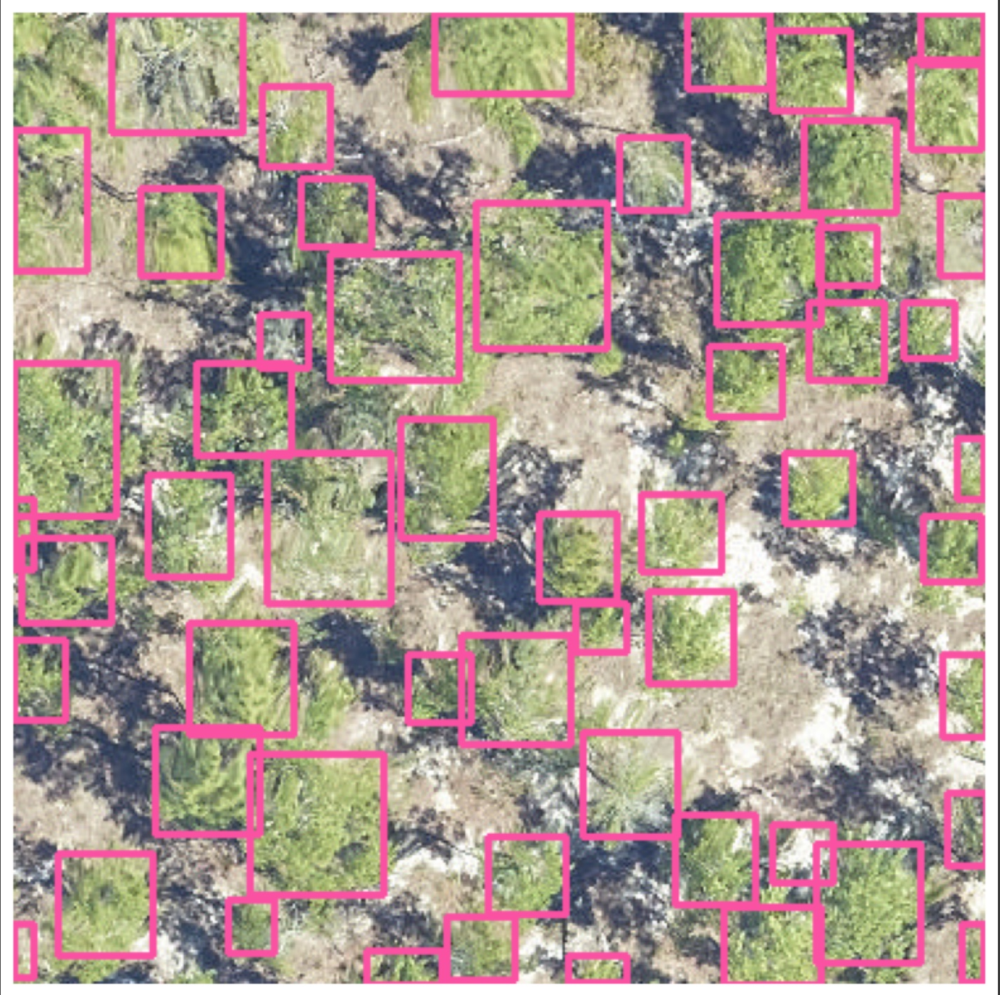
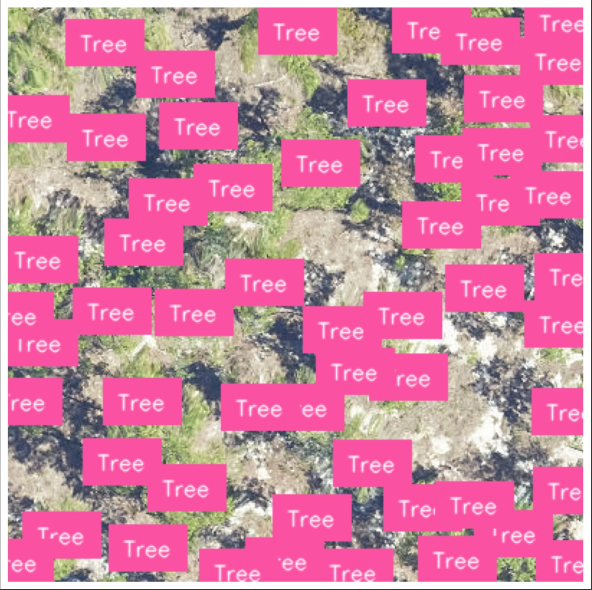

# Visualization

Simple visualization can be done during inference and saved. These are intended as quick ways of looking at data.

The color and line thickness of boxes can be customized using the `color` and `thickness` arguments.
`color` is the color of the bounding box as a tuple of BGR color, e.g. orange annotations is (0, 165, 255).
`thickness` is the thickness of the rectangle border line in pixels.

```python
image_path = get_data("OSBS_029.png")
boxes = model.predict_image(path=image_path, return_plot = True, color=(0, 165, 255), thickness=3)
```

For a bit more interactivity, we can use matplotlib to directly draw boxes on the image

```
from deepforest import main
from deepforest import visualize
from matplotlib import pyplot as plt
from PIL import Image
import numpy as np

image_path = "<path on disk>"

# Open and create numpy array
image = np.array(Image.open(image_path))
m = main.deepforest()
boxes = m.predict_image(image=image)
fig = visualize.plot_predictions(image=image, df=boxes)
plt.imshow(fig)
plt.show()
```

## Advanced visualizations using Roboflow's supervision package

The `convert_to_sv_format` function converts DeepForest prediction results into a `supervision.Detections` object. This object contains bounding boxes, class IDs, confidence scores, and class names. It is designed to facilitate the visualization and further processing of object detection results using [supervision](https://supervision.roboflow.com/latest/) library.

### Arguments

- `df (pd.DataFrame)`: The DataFrame containing the results from `predict_image` or `predict_tile`. The DataFrame is expected to have the following columns:
  - `xmin`: The minimum x-coordinate of the bounding box.
  - `ymin`: The minimum y-coordinate of the bounding box.
  - `xmax`: The maximum x-coordinate of the bounding box.
  - `ymax`: The maximum y-coordinate of the bounding box.
  - `label`: The class label of the detected object.
  - `score`: The confidence score of the detection.
  - `image_path`: The path to the image (optional, not used in this function).

### Returns

- `sv.Detections`: A `supervision.Detections` object containing:
  - `xyxy (ndarray)`: A 2D numpy array of shape (_, 4) with bounding box coordinates.
  - `class_id (ndarray)`: A numpy array of integer class IDs.
  - `confidence (ndarray)`: A numpy array of confidence scores.
  - `data (Dict[str, List[str]])`: A dictionary containing additional data, including class names.

### Example 1: Converting Prediction Results and Annotating an Image

```python
import supervision as sv
from deepforest import main
from deepforest import get_data
from deepforest.visualize import convert_to_sv_format
import matplotlib.pyplot as plt
import cv2
import numpy as np
import pandas as pd

# Initialize the DeepForest model
m = main.deepforest()
m.use_release()

# Load image
img_path = get_data("OSBS_029.tif")
image = cv2.imread(img_path)

# Predict using DeepForest
result = m.predict_image(img_path)


# Convert custom prediction results to supervision format
sv_detections = convert_to_sv_format(result)

# You can now use `sv_detections` for further processing or visualization
```
To show bounding boxes:
```python
# You can visualize predicted bounding boxes

bounding_box_annotator = sv.BoundingBoxAnnotator()
annotated_frame = bounding_box_annotator.annotate(
    scene=image.copy(),
    detections=sv_detections
)


# Display the image using Matplotlib
plt.imshow(annotated_frame)
plt.axis('off')  # Hide axes for a cleaner look
plt.show()

```



To show labels:

``` python

label_annotator = sv.LabelAnnotator(text_position=sv.Position.CENTER)
annotated_frame = label_annotator.annotate(
    scene=image.copy(),
    detections=sv_detections,
    labels=sv_detections['class_name']
)

# Display the image using Matplotlib
plt.imshow(annotated_frame)
plt.axis('off')  # Hide axes for a cleaner look
plt.show()
```

---
